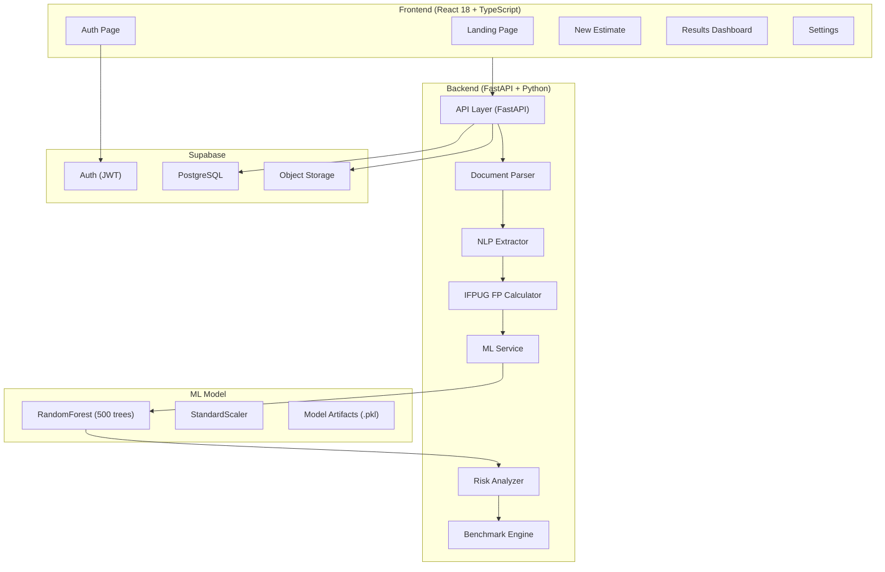

# PredictIQ — AI-Powered Software Project Cost & Timeline Predictor


## What is PredictIQ?

PredictIQ is a full-stack SaaS application that predicts software project **cost**, **timeline**, and **effort** from uploaded project documentation. Users upload a PDF, DOCX, or plain-text requirements specification, and PredictIQ uses NLP-based feature extraction combined with a machine learning model trained on **740 real-world software projects** from 4 countries to generate data-driven estimates with confidence intervals, risk scores, phase breakdowns, and benchmark comparisons against historical projects.

---

## How It Works

1. **Upload** — User uploads a project specification document (PDF, DOCX, or TXT)
2. **Extract** — NLP engine (regex + 60+ keyword library) extracts 8 parameters: project type, team size, duration, complexity, methodology, tech stack, features, and scope
3. **Size** — IFPUG Function Point Analysis computes Adjusted Function Points (size_fp) using 14 technical complexity factors
4. **Predict** — ML model (RandomForestRegressor, 500 trees) predicts `log(effort+1)` from a 27-feature vector, converts back to hours
5. **Report** — Risk analyzer scores 10 weighted factors, benchmark engine compares against the 740-project corpus, phase breakdown divides effort into 6 SDLC stages

---

## Architecture



---

## ML Model Performance

| Metric | Value | Benchmark | Status |
|--------|-------|-----------|--------|
| **R² (Test Set)** | 0.8953 | 0.50–0.85 (typical) | ✅ Above |
| **PRED(25%)** | 57.4% | 30–50% (typical) | ✅ Above |
| **MMRE** | 37.2% | 30–50% (typical) | ✅ Within |
| **CV R² (10-fold)** | 0.9878 ± 0.0085 | — | ✅ Stable |

**What these mean in plain English:**
- **R² = 0.8953**: The model explains ~90% of the variance in software project effort. Higher is better (max 1.0).
- **PRED(25%) = 57.4%**: 57% of the model's predictions are within 25% of the actual effort. The higher this number, the more practically useful the model.
- **MMRE = 37.2%**: On average, predictions differ from actual by 37%. Lower is better.
- **CV R² = 0.9878 ± 0.0085**: The model is extremely stable across all data splits — the ± value measures consistency.

---

## Training Dataset

| Dataset | Source | Rows | Country | Era |
|---------|--------|------|---------|-----|
| Desharnais + Maxwell | PROMISE Repository | 143 | Canada + Finland | 1988–2002 |
| China (Li Zheng) | Zenodo / PROMISE | 481 | China | 2009 |
| NASA93 | Zenodo / PROMISE | 92 | USA | 1993 |
| Albrecht & Gaffney | Zenodo / PROMISE | 24 | USA | 1983 |
| **Total** | **4 sources** | **740** | **4 countries** | **1983–2009** |

---

## Tech Stack

| Layer | Technology | Version | Purpose |
|-------|-----------|---------|---------|
| **Frontend** | React | 18.x | UI framework |
| | TypeScript | 5.x | Type safety |
| | Vite | 5.x | Build tool |
| | Zustand | latest | State management |
| | Axios | latest | HTTP client |
| | Recharts | latest | Data visualization |
| **Backend** | FastAPI | 0.135 | API framework |
| | Uvicorn | latest | ASGI server |
| | Pydantic v2 | latest | Data validation |
| | structlog | latest | Structured logging |
| **ML** | scikit-learn | 1.8.0 | RandomForestRegressor |
| | XGBoost | latest | Training comparison |
| | pandas / numpy | latest | Data processing |
| **Database** | Supabase | — | Auth + PostgreSQL + Storage |
| **DevOps** | Docker | — | Containerization |
| | Nginx | alpine | Reverse proxy |
| | GitHub Actions | — | CI pipeline |

---

## Project Structure

```
PredictIQ/
├── backend/
│   ├── main.py                  # FastAPI app entry point
│   ├── requirements.txt         # Python dependencies
│   ├── .env.example             # Environment variable template
│   ├── app/
│   │   ├── api/v1/              # API route handlers
│   │   │   ├── health.py        # GET /api/v1/health
│   │   │   ├── documents.py     # POST /api/v1/documents/upload
│   │   │   ├── estimates.py     # POST /api/v1/estimates/analyze
│   │   │   └── export.py        # GET /api/v1/export/{id}/pdf
│   │   ├── core/config.py       # Pydantic settings
│   │   ├── models/              # Pydantic request/response schemas
│   │   ├── services/            # Business logic layer
│   │   │   ├── document_parser.py
│   │   │   ├── nlp_extractor.py
│   │   │   ├── ml_service.py
│   │   │   ├── cost_calculator.py
│   │   │   ├── risk_analyzer.py
│   │   │   ├── benchmark.py
│   │   │   └── export_service.py
│   │   └── utils/               # Validators, formatters
│   ├── ml/
│   │   ├── train.py             # Model training pipeline
│   │   ├── inference.py         # Singleton inference engine
│   │   ├── predictiq_best_model.pkl
│   │   ├── predictiq_scaler.pkl
│   │   └── predictiq_features.json
│   └── tests/                   # Pytest test suite (8 modules)
├── frontend/
│   ├── src/
│   │   ├── App.tsx              # Root component + routing
│   │   ├── pages/               # 7 page components
│   │   ├── components/          # Shared UI components
│   │   ├── store/               # Zustand state stores
│   │   ├── services/            # API client (Axios)
│   │   └── lib/                 # Supabase client
│   └── .env.example
├── supabase/
│   └── migrations/              # PostgreSQL DDL + RLS policies
├── Dockerfile.backend
├── Dockerfile.frontend
├── docker-compose.yml
├── nginx.conf
├── .github/workflows/ci.yml
├── .gitignore
└── README.md                    ← You are here
```

---

## Quick Start — Local Development

### Prerequisites
- Python 3.11+
- Node.js 20+
- Git

### 1. Clone the repository
```powershell
git clone https://github.com/your-org/PredictIQ.git
cd PredictIQ
```

### 2. Backend setup
```powershell
python -m venv venv
.\venv\Scripts\Activate.ps1
pip install -r backend\requirements.txt
copy backend\.env.example backend\.env
# Edit backend/.env with your Supabase credentials
cd backend
python -m uvicorn main:app --reload --port 8000
```

### 3. Frontend setup (separate terminal)
```powershell
cd frontend
npm ci
copy .env.example .env
# Edit .env with VITE_SUPABASE_URL and VITE_SUPABASE_ANON_KEY
npm run dev
```

### 4. Verify
- Frontend: http://localhost:5173
- Backend API: http://localhost:8000/docs
- Health check: http://localhost:8000/api/v1/health

---

## Quick Start — Docker

```bash
docker-compose up --build
```

Access: http://localhost:3000

---

## Environment Variables

See [backend/.env.example](backend/.env.example) and [frontend/.env.example](frontend/.env.example) for full documentation.

| Variable | Required | Source |
|----------|----------|--------|
| `SUPABASE_URL` | ✅ | Supabase Dashboard → Settings → API |
| `SUPABASE_ANON_KEY` | ✅ | Supabase Dashboard → Settings → API |
| `SUPABASE_SERVICE_ROLE_KEY` | ✅ | Supabase Dashboard → Settings → API |
| `JWT_SECRET` | ✅ | Supabase Dashboard → Settings → API |
| `VITE_SUPABASE_URL` | ✅ | Same as SUPABASE_URL |
| `VITE_SUPABASE_ANON_KEY` | ✅ | Same as SUPABASE_ANON_KEY |

---

## Running Tests

```powershell
cd backend
.\venv\Scripts\Activate.ps1
pip install pytest pytest-asyncio httpx
python -m pytest tests/ -v --tb=short
```

---

## API Reference

| Method | Path | Auth | Description |
|--------|------|------|-------------|
| `GET` | `/api/v1/health` | No | System health + model status |
| `POST` | `/api/v1/documents/upload` | Yes | Upload project document |
| `POST` | `/api/v1/estimates/analyze` | Yes | Generate estimate from document |
| `POST` | `/api/v1/estimates/manual` | Yes | Generate estimate from manual input |
| `GET` | `/api/v1/estimates` | Yes | List user's estimates |
| `GET` | `/api/v1/estimates/{id}` | Yes | Get single estimate details |
| `DELETE` | `/api/v1/estimates/{id}` | Yes | Soft-delete an estimate |
| `POST` | `/api/v1/estimates/{id}/share` | Yes | Generate shareable link |
| `GET` | `/api/v1/estimates/shared/{token}` | No | View shared estimate |
| `GET` | `/api/v1/export/{id}/pdf` | Yes | Export estimate as PDF |
| `GET` | `/api/v1/export/{id}/csv` | Yes | Export estimate as CSV |
| `GET` | `/` | No | API root info |

---

## ML Retraining

```powershell
.\venv\Scripts\Activate.ps1
python backend/ml/train.py
```

GPU auto-detected (CUDA). Falls back to CPU if no GPU available.
Outputs: `predictiq_best_model.pkl`, `predictiq_scaler.pkl`, `training_report.json`

---

## Citation

If using the training datasets in academic work, cite:

```
Desharnais, J.-M. (1988). Analyse statistique de la productivite des projets informatique.
Maxwell, K. (2002). Applied Statistics for Software Managers.
Li, Z., Jing, X.-Y., & Zhu, X. (2009). China software industry data.
NASA (1993). NASA93 software project dataset. PROMISE Repository.
Albrecht, A.J. & Gaffney, J.E. (1983). Software function, source lines of code, and development effort prediction.
```

---

## License

MIT License — see [LICENSE](LICENSE) for details.
