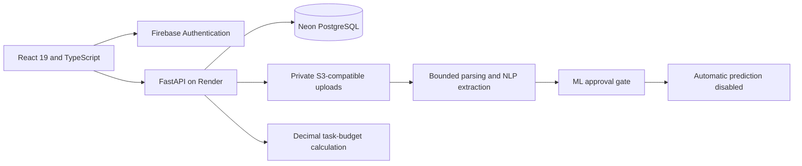

# PredictIQ

Software-project planning with authenticated task budgets, document extraction and an independently gated ML research pipeline.

## Current release

The working release path is **manual budgeting**: supply low/likely/high task effort, USD hourly rates and contingency; save and revisit the assumptions behind the calculated totals. Ranges are user-defined scenarios, not calibrated predictions. Taxes and non-labour expenses are excluded.

**Automatic ML predictions remain unavailable.** The original model and benchmark data were revoked after incorrect labels were confirmed. Larger public-data experiments have not met production accuracy and applicability gates. No reliable model accuracy percentage is claimed, and manual budgets are not ML training labels.

Connected staging: https://predictiq-preview.vercel.app. Deployments are made only from `dev2`; see the walkthrough for the latest verified deployment and acceptance evidence.

## Architecture

```mermaid
flowchart LR
    UI[React 19 and TypeScript] --> Auth[Firebase Authentication]
    UI --> API[FastAPI on Render]
    API --> DB[(Neon PostgreSQL)]
    API --> Objects[Private S3-compatible uploads]
    API --> Budget[Decimal task-budget calculation]
    Objects --> NLP[Bounded parsing and NLP extraction]
    NLP --> Gate[ML approval gate]
    Gate --> Unavailable[Automatic prediction disabled]
```

Budgets use separate immutable assumption records, owner-filtered queries and editor write permissions. Viewer accounts can read their own budgets. Admin access does not bypass budget ownership. Monetary totals are calculated server-side with decimal arithmetic and rounded once to cents. Document parsing, object storage, authentication and model artifacts have separate validation boundaries.

## Local development

Requirements: Python 3.13, Node.js 22 and an isolated PostgreSQL database.

1. Create a backend virtual environment and install `backend/requirements.lock.txt`.
2. Copy `backend/.env.example` to ignored `backend/.env`; configure the database and your Firebase Admin credentials. Use a local test Firebase project/emulator rather than production accounts.
3. From `backend`, apply `python -m alembic upgrade head`, then start `python serve.py`.
4. Copy `frontend/.env.example` to ignored `frontend/.env` and configure the matching Firebase web application. From `frontend`, run `npm ci` and `npm run dev`.
5. Open the frontend and use **Budget Planner**. The `/estimates/manual` endpoint is an ML endpoint and is separate from `/budgets`.

`RELEASE_MODE=prediction` is the default and requires an approved model for readiness. Explicit `RELEASE_MODE=manual_budget` requires database, budget schema and Firebase readiness while reporting automatic prediction availability separately. Hosted environments require durable upload storage. Never commit `.env`, private keys, operational identities or database dumps.

## Verification

- Backend: `python -m pytest tests` from `backend`; real database cases require `PREDICTIQ_TEST_DATABASE_URL` pointing to an isolated migrated test database.
- Frontend: `npm run typecheck`, `npm run lint`, `npm test`, `npm run build`.
- Browser: `npx playwright test`; authenticated Firebase-emulator coverage uses `playwright.auth.config.ts` and `firebase.test.json`.
- Live acceptance is opt-in via `playwright.live.config.ts`, using pre-provisioned synthetic operational identities. It does not establish model accuracy.
- Recovery scripts restore only to isolated destinations and keep private evidence under ignored `.tools`.

## Documentation

- [Technical walkthrough, diagrams and acceptance evidence](docs/walkthrough.md)
- [Production deployment runbook](docs/runbooks/production-deployment.md)
- [ML data integrity correction and reconstruction](docs/ml_rebuild_2026-09-09.md)

The walkthrough retains historical architecture and experiment details. Its dated verification entries distinguish tested implementation, hosted acceptance and unresolved model validation.
