# Production deployment inputs

Updated September 15, 2026. Railway backend and Vercel frontend configuration is prepared. Target projects are not yet confirmed; no deployment has occurred. Credential rotation is reported complete by the owner.

## Owner-provided inputs

| Item | Required information / secure destination |
|---|---|
| Hosting | Railway project/environment/service and Vercel team/project names or dashboard URLs; authenticated CLI/provider access |
| Budget and region | Monthly spending cap and preferred region; no paid resources or datasets purchased without this decision |
| Domains | Frontend/API origins; provider domains are sufficient initially |
| Database | `DATABASE_URL` in Railway variables; separate staging/production databases, TLS, migration privileges and backups |
| Firebase Admin | `FIREBASE_CREDENTIALS_JSON` in Railway secrets, for the intended project; never browser code |
| Firebase browser | Six `VITE_FIREBASE_*` fields in Vercel build variables, from the matching Firebase web-app settings |
| Private uploads | `STORAGE_BACKEND=s3`, `S3_BUCKET_NAME`, `S3_REGION`, optional `S3_ENDPOINT_URL`, scoped `S3_ACCESS_KEY_ID` and `S3_SECRET_ACCESS_KEY` or provider identity |
| Model | Approved bundle, `ML_PIPELINE_MANIFEST` and `ML_PIPELINE_MANIFEST_SHA256`; no approved model currently exists |
| Live acceptance | Dedicated Firebase test accounts, including another user for ownership-denial checks; passwords stored securely, not in chat |
| Operations | Alert recipient, document retention/deletion policy, acceptable backup data-loss window and recovery time |

Put secrets directly in provider dashboards or approved secret storage. Chat only needs non-secret identifiers. Firebase sign-in providers and authorized domains must match the deployed frontend. Storage must block anonymous reads and have a verified backup/versioning policy.

## Deployment contract

Railway service root is the repository root. `railway.toml` selects `Dockerfile.backend`, runs Alembic before startup and waits for `/api/v1/ready`. The container honors `PORT`. Keep one API worker and one replica until rate-limit state is shared; configure provider memory limits and validate hostile-document load before scaling.

Set `APP_ENV=staging` or `production` and `ALLOWED_ORIGINS` to exact HTTPS frontend origins. An API host is an origin such as `https://api.example.com`; frontend **`VITE_API_BASE_URL` must include `/api/v1`**. Vercel project root is `frontend`; `vercel.json` supplies SPA routing and headers. Build-time Vite variables must be configured before build. Deploy this source project, not an unconfigured `dist` directory.

The historical tag-based production and `dev` staging workflows are not the authorized `dev2` release route. Do not invoke them, create tags or push main to work around this. Until the selected provider workflow is adapted, use an explicitly tested `dev2` commit and manual provider deployment with auto-deploy disabled. The current ML execution hold also covers push-triggered CI model tests.

```mermaid
flowchart LR
    Inputs[Provider configuration and selected dev2 commit] --> Preflight[Offline checks]
    Preflight --> CI[Authorized tests and security gates]
    CI --> Backup[Database and object backup]
    Backup --> Migrate[Additive migrations]
    Migrate --> Stage[Staging readiness and real E2E]
    Stage --> Restore[Restore and rollback rehearsal]
    Restore --> Launch[Production and monitoring]
```

Run `python scripts/production_preflight.py` in the target process environment. It does not read local `.env`, contact providers, load models or print secret values. Passing checks configuration shape only, not credential validity, artifact approval or live readiness.

Before launch, record commit/artifact hashes, CI results, migration head `005_role_retry`, HTTPS/CORS, real sign-in and revocation, estimation with the approved model, cross-user denial, deep-link reload, restart persistence, private object access and populated restoration. Monitor readiness, errors, latency, parser saturation and pending role updates.

Current blockers: selected hosting/access; compatible licensed modern project data; explicit authorization to execute and validate the new ML pipeline; independent model approval; live configuration, load, backup and rollback acceptance. The existing 891 historical projects do not constitute the required nine-feature production dataset.

Sources: [Railway configuration](https://docs.railway.com/config-as-code/reference), [Railway pre-deploy migrations](https://docs.railway.com/deployments/pre-deploy-command), [Vercel SPA routing](https://vercel.com/kb/guide/why-is-my-deployed-project-giving-404), [Firebase Admin setup](https://firebase.google.com/docs/admin/setup).
