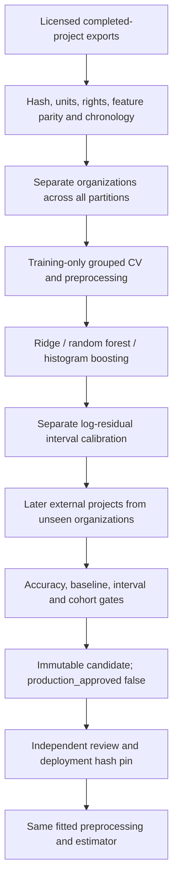

# Production ML: validation and release gates

Updated September 18, 2026. The owner has approved proceeding with the model, lifting the earlier execution hold. Five production pipeline regression tests pass, including actual grouped-CV preprocessing, fitting and candidate export using a synthetic 1,000-row fixture and a restricted Ridge search. This verifies code behavior, not real-project accuracy. No production model is approved by the technical gates or configured for serving.

## Data available versus data required

The research collection `expanded-v2` contains **891 historical projects**: China 499, Desharnais 81, Maxwell 62, Kitchenham 145, and AT&T 104. The legacy 740-row dataset has corrupted labels and is revoked. The 891-row collection is not a compatible nine-feature production training set. Existing external results did not qualify its research models for production.

`ml/production_pipeline.py` requires at least **1,000 genuine completed projects**, including at least 600 training, 100 calibration and 200 external projects. This is a minimum intake gate, not an acquired dataset or a guaranteed final row count. It does not generate synthetic projects, duplicate tasks into projects, or substitute category codes for observed effort. Larger licensed project exports still need to be obtained and mapped. Historical public data cannot establish performance on current projects by itself.

## Feature contract

The proposed model uses nine planning-time inputs, in this order:

| Input | Meaning and compatibility requirement |
|---|---|
| `size_fp` | Planning-time functional size, measured compatibly with the application extractor; actual delivered size is not interchangeable |
| `team_size` | Planned team headcount |
| `feature_count` | Planned features counted using the application definition |
| `integration_count` | Planned external integrations, matching API counting rules |
| `volatility_score` | Planning-time requirement volatility, API scale 1–5 |
| `team_experience` | Planning-time experience, API scale 1–4 |
| `project_type` | Application project category, with documented source mapping |
| `complexity` | Low, Medium, High or Very High under the application's rubric |
| `methodology` | Agile, Waterfall or Hybrid |

The target is observed total **person-hours**, not elapsed duration, story points, task count or a resource category. Cost remains derived from predicted effort and the user's hourly rate; this is not a separately validated market-price model. Risk and phase allocations remain application heuristics.

Required metadata includes globally stable `project_id` and `organization_id`, `planning_date`, `completion_date`, and an explicit `partition` (`train`, `calibration`, `external_test`). Manifest entries require source SHA-256, usage-rights evidence and feature-parity evidence. A column rename alone does not establish semantic parity: independently measured function points and NLP-estimated size require validation against the same projects before approval. Unknown observations must remain missing, not fabricated. Each feature needs at least 80% observed training coverage; serving currently requires all nine inputs and rejects unseen categories and out-of-range values.

## Selection and release gates

Training uses five-fold organization-grouped CV, with imputation, scaling and category encoding fitted within each fold. The target transformation is log1p/expm1. At least five training organizations and two external organizations are required. External projects must start after all development/calibration outcomes were available and no earlier than 2020. Duplicate IDs, cross-partition organization leakage and repeated feature/target observations fail intake.

Provisional engineering gates: external MAE at least 15% better than the training median baseline, MdAPE at most 30%, PRED25 at least 60%, observed interval coverage at least 85%, median interval-width/prediction ratio at most 2, and every external organization MdAPE at most 50%. These are acceptance targets, not achieved metrics. Review cohort sizes and organizational dependence: split-conformal nominal coverage is not guaranteed under population shift. Inspect errors and interval usefulness by project type, size and date before promotion. Once inspected, an external dataset must not be reused as an untouched test after tuning decisions.

## Candidate training and review

1. Place approved CSV sources under an untracked local manifest directory. Adapt `ml/production_sources.example.json`; record real rights/parity evidence and verified hashes.
2. After obtaining compatible licensed source data, rerun the production pipeline regressions, then from `backend` run `python -m ml.production_pipeline path/to/sources.json ml/experiments/new-candidate`. The output directory must not exist.
3. Review `manifest.json` and protected `external_predictions.csv`, source provenance, cohort errors, latency, extraction parity and operational behavior. Outputs contain project-level information and must not be committed by default.
4. Only after independent approval, record `reviewer`, `approval_evidence` and `production_approved: true` in a reviewed manifest. The training program never approves itself. Compute its final SHA-256 and configure `ML_PIPELINE_MANIFEST` and `ML_PIPELINE_MANIFEST_SHA256` together.
5. Deploy only trusted, hash-pinned local artifacts; pickle can execute code and checksums do not make an untrusted artifact safe. Serving checks the exact sklearn version, manifest and model hashes before loading. Keep the previous approved bundle for rollback; the revoked legacy model is not a rollback candidate.

Remaining production ML gates: acquire sufficient compatible licensed modern data; train and evaluate on genuine compatible data; validate extraction-to-training parity, accuracy and subgroups, latency and memory; independently approve a bundle; rehearse deployment, monitoring and rollback. Neither the deterministic authenticated E2E fixture nor static checks close these gates.
