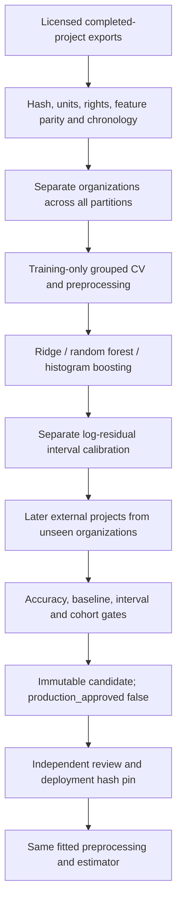

# Production ML: validation and release gates

Updated September 18, 2026. The owner has approved proceeding with the model, lifting the earlier execution hold. Five production pipeline regression tests pass, including actual grouped-CV preprocessing, fitting and candidate export using a synthetic 1,000-row fixture and a restricted Ridge search. This verifies code behavior, not real-project accuracy. No production model is approved by the technical gates or configured for serving.

## Data available versus data required

The research collection `expanded-v2` contains **891 historical projects**: China 499, Desharnais 81, Maxwell 62, Kitchenham 145, and AT&T 104. The legacy 740-row dataset has corrupted labels and is revoked. The 891-row collection is not a compatible nine-feature production training set. Existing external results did not qualify its research models for production.

`ml/production_pipeline.py` requires at least **1,000 genuine completed projects**, including at least 600 training, 100 calibration and 200 external projects. This is a minimum intake gate, not an acquired dataset or a guaranteed final row count. It does not generate synthetic projects, duplicate tasks into projects, or substitute category codes for observed effort. Larger licensed project exports still need to be obtained and mapped. Historical public data cannot establish performance on current projects by itself.

## Feature contract

The proposed model uses nine planning-time inputs, in this order:

| Input | Meaning and compatibility requirement |
|---|---|
| `size_fp` | Planning-time functional size, measured compatibly with the application extractor; actual delivered size is not interchangeable |
| `team_size` | Planned team headcount |
| `feature_count` | Planned features counted using the application definition |
| `integration_count` | Planned external integrations, matching API counting rules |
| `volatility_score` | Planning-time requirement volatility, API scale 1–5 |
| `team_experience` | Planning-time experience, API scale 1–4 |
| `project_type` | Application project category, with documented source mapping |
| `complexity` | Low, Medium, High or Very High under the application's rubric |
| `methodology` | Agile, Waterfall or Hybrid |

The target is observed total **person-hours**, not elapsed duration, story points, task count or a resource category. Cost remains derived from predicted effort and the user's hourly rate; this is not a separately validated market-price model. Risk and phase allocations remain application heuristics.

Required metadata includes globally stable `project_id` and `organization_id`, `planning_date`, `completion_date`, and an explicit `partition` (`train`, `calibration`, `external_test`). Manifest entries require source SHA-256, usage-rights evidence and feature-parity evidence. A column rename alone does not establish semantic parity: independently measured function points and NLP-estimated size require validation against the same projects before approval. Unknown observations must remain missing, not fabricated. Each feature needs at least 80% observed training coverage; serving currently requires all nine inputs and rejects unseen categories and out-of-range values.

## Selection and release gates

Training uses five-fold organization-grouped CV, with imputation, scaling and category encoding fitted within each fold. The target transformation is log1p/expm1. At least five training organizations and two external organizations are required. External projects must start after all development/calibration outcomes were available and no earlier than 2020. Duplicate IDs, cross-partition organization leakage and repeated feature/target observations fail intake.

Provisional engineering gates: external MAE at least 15% better than the training median baseline, MdAPE at most 30%, PRED25 at least 60%, observed interval coverage at least 85%, median interval-width/prediction ratio at most 2, and every external organization MdAPE at most 50%. These are acceptance targets, not achieved metrics. Review cohort sizes and organizational dependence: split-conformal nominal coverage is not guaranteed under population shift. Inspect errors and interval usefulness by project type, size and date before promotion. Once inspected, an external dataset must not be reused as an untouched test after tuning decisions.

## Candidate training and review

1. Place approved CSV sources under an untracked local manifest directory. Adapt `ml/production_sources.example.json`; record real rights/parity evidence and verified hashes.
2. After obtaining compatible licensed source data, rerun the production pipeline regressions, then from `backend` run `python -m ml.production_pipeline path/to/sources.json ml/experiments/new-candidate`. The output directory must not exist.
3. Review `manifest.json` and protected `external_predictions.csv`, source provenance, cohort errors, latency, extraction parity and operational behavior. Outputs contain project-level information and must not be committed by default.
4. Only after independent approval, record `reviewer`, `approval_evidence` and `production_approved: true` in a reviewed manifest. The training program never approves itself. Compute its final SHA-256 and configure `ML_PIPELINE_MANIFEST` and `ML_PIPELINE_MANIFEST_SHA256` together.
5. Deploy only trusted, hash-pinned local artifacts; pickle can execute code and checksums do not make an untrusted artifact safe. Serving checks the exact sklearn version, manifest and model hashes before loading. Keep the previous approved bundle for rollback; the revoked legacy model is not a rollback candidate.

Remaining production ML gates: acquire sufficient compatible licensed modern data; train and evaluate on genuine compatible data; validate extraction-to-training parity, accuracy and subgroups, latency and memory; independently approve a bundle; rehearse deployment, monitoring and rollback. Neither the deterministic authenticated E2E fixture nor static checks close these gates.

## September 18 expanded historical experiment

`python -m ml.expanded_research ml/experiments/expanded-v3-20260918` trained eight fixed candidates on the 891-row historical development collection. Model selection used five held-out-source folds, excluding matching size/effort pairs across each fold. Source identity does not establish organization independence. Earlier external outcomes are now development data, explicitly not reused as untouched tests.

Acquired 24 Albrecht projects for a separate external diagnostic: `AdjFP` is the size column and `Effort` is converted from thousands of person-hours to hours. Total research collection: **915 projects**, with **891 used to fit** and **24 reserved for external evaluation**. This is not a 915-row training set or a nine-feature production dataset.

Selected power-law Huber: external MAE 17,178.48 hours, MdAPE 68.55%, PRED(25) 4.17%, R-squared -0.189. Median baseline MAE 19,694.75 hours. The roughly 12.8% MAE reduction versus a constant median does not establish improvement over the earlier fitted model or satisfy production quality gates. Candidate remains unapproved, and the now-observed external cohort must not guide further tuning as if untouched.

Source: https://github.com/Derek-Jones/Software-estimation-datasets/blob/main/albrecht.arff . Public research provenance is recorded; production redistribution rights, measurement compatibility and prospective validation remain unresolved. Only scripts and tests belong in Git; raw data and experiment artifacts remain local.

Additional source screened: [Itemlet](https://zenodo.org/records/19411554), 727,282 issue records across 204 projects and 108 columns under stated CC-BY 4.0. Downloaded its dictionary and project summaries for inspection, not its full issue corpus. The dictionary includes post-outcome activity and target-derived features, incomplete dates, and a documented completion-time derivation error. Issue-level logged hours and elapsed cycle time cannot be relabelled as complete-project effort. This source is not merged into PredictIQ production data.

## September 22: alternative contracts and larger task datasets

The owner explicitly permits replacing the nine-feature format. Deployment is deferred while model reliability is investigated. The existing prospective project pipeline remains an optional contract; it must not constrain new evidence-backed model designs.

### Reproducible acquisition

From `backend`, run `python -m ml.acquire_research` to fetch or verify the reviewed SiP CSV snapshots and JOSSE SQLite database/license. Downloads are size-bounded and SHA-256 checked; changed existing files are preserved and rejected. Do not execute downloaded code. Research data and generated artifacts stay untracked.

### Human-estimate calibration experiment

`python -m ml.task_calibration ml/data/research/sip ml/experiments/task-calibration-v1-20260918`

New inputs: planned task hours, work category and subcategory. Target: actual task person-hours. SiP contains 12,299 developer rows representing 10,266 unique tasks; repeated developer rows must not multiply task totals. Completed, dated, positive-effort intake retained **8,175 tasks across 18 project codes**. Time-separated train/calibration/test counts were **6,485 / 860 / 806**; 24 tasks whose outcomes crossed partition boundaries were purged. Six candidate configurations included the unchanged human estimate as a comparator. Selected model: log-target histogram boosting with seven leaves.

Later-task MAE: **4.097 hours**, versus **4.118 hours** for human estimates. Model MdAPE **36.15%** versus human **31.83%**; PRED(25) **38.34%** versus human **46.53%**. The project-clustered 95% bootstrap interval for MAE difference was **[-0.686, +0.441] hours**. The tiny average-error reduction is not a clear improvement. Observed 90%-nominal interval coverage was **88.21%**; task dependence and population shift prevent a coverage guarantee. Candidate remains unapproved.

Source: https://github.com/Derek-Jones/SiP_dataset and https://arxiv.org/abs/1901.01621 . Public research availability does not resolve production redistribution rights. Category snapshots may have changed after planning. This model calibrates existing human estimates; it cannot replace document-to-project estimation.

### Task-description experiment

`python -m ml.text_effort ml/data/research/josse/JOSSE_18092020.sqlite3 ml/experiments/text-effort-v1-20260922`

New input: task description text. Target: logged task person-hours; JIRA seconds are divided by 3,600. JOSSE source: https://github.com/ml-see/josse (MIT; retain upstream license). Read-only SQLite intake excludes activity/comment counts, IDs and project codes from model features. Removed 12 invalid entries and 58 repeated normalized descriptions from **23,186 records**, leaving **23,116 tasks across 370 project codes**. These are task records, not 23,116 completed software projects.

Whole-project train/calibration/test split: **13,802 / 2,820 / 6,494 tasks**, across **222 / 74 / 74 projects**. Training-only grouped CV selects between two TF-IDF/log-Ridge configurations. Vocabulary/preprocessing are fitted inside each fold. Held-out-project results: MAE **3.010 hours**, MdAPE **78.64%**, PRED(25) **13.81%**. Median baseline MAE **3.029 hours**, PRED(25) **15.66%**. Project-clustered MAE-difference interval **[-0.150, +0.127] hours** includes zero. On the 909 test tasks with expert estimates, model PRED(25) was **14.30%** versus expert **40.92%**. Candidate remains unapproved.

Observed interval coverage **95.29%** does not rescue poor point estimates or establish useful intervals; median interval width was **14.65 hours**. Source descriptions are retrospective snapshots without planning-time histories. Project separation is not organization separation, and no chronological or prospective claim is made.

### Interpretation and next evidence requirement

Neither larger task dataset established a reliable replacement. The paired comparison helper resamples entire projects, suppresses confidence claims with fewer than five groups, and requires no regression in MdAPE/PRED(25) before labelling a cohort result a clear improvement. Even a passing statistical comparison never automatically grants production approval.

Do not add task counts to the 915 historical project count, promote a model because one metric marginally improves, tune against these now-observed test outcomes while calling them untouched, or sum individual task intervals as a calibrated whole-project interval. Further model designs need stronger planning-time context and genuinely independent validation. Modern datasets and project-level alternatives remain under investigation.

### SEERA provenance audit and validation correction (September 22)

Primary source: https://zenodo.org/records/4312777. Archive SHA-256 `4eb4ccd32d3c6d86f0ef6a8feec6ad823a0feae56556aa54b622ff94119dcc75`, 3,311,539 bytes. The included **SEERA dataset attribute formulas.pdf** defines actual effort as actual duration times effective staffing times daily hours times 22 working days. All 120 rows in the prediction CSV match exactly (maximum absolute difference: zero hours). This is a derived capacity target, not independent recorded labor. Do not use its actual-duration feature for planning inference or report fitting this formula as demonstrated actual-effort accuracy. SMOGN files are synthetic and excluded from real-project counts.

Reproduce from backend: `python -m ml.audit_seera ml/data/research/seera/dataset.zip`. The audit requires the reviewed archive hash and performs no training or promotion.

The SiP rolling validation implementation now uses disjoint, half-open date windows. Earlier experiment output remains unchanged and identifies its original code hash; previously observed test cohorts cannot be claimed as untouched evidence after further tuning. Regression coverage verifies no duplicate validation dates and no future completed outcomes in fitting.

### Expanded task research, September 22 (second iteration)

Owner reaffirmed freedom to revise features, datasets and model architecture. Built `ml.hybrid_effort`: human task estimate plus optional task text, log-ratio corrections bounded to 0.25x-4x, 12 candidate configurations and an unchanged-human comparator. Nested four-outer/three-inner project folds use only the original JOSSE development partition (2,467 eligible tasks, 130 projects); previous calibration/test projects are excluded. Every outer fold selected the human comparator. No accuracy gain or final artifact is claimed for this experiment (`hybrid-development-v1-20260922`).

Downloaded the complete Itemlet snapshot from https://zenodo.org/records/19411554 under its stated CC BY 4.0 terms: **727,282 issues, 204 projects, 108 source columns, 438,479,440 bytes**. SHA-256: `f03d31866326a89690fa43c806bfc75b527e014de21c438e8d2bbe59dd3faf4a`. Raw files and trained artifacts remain ignored. `python -m ml.acquire_research --itemlet` reproduces acquisition; downloads and existing-file checks now use bounded memory.

`ml.audit_itemlet` reports 47,482 positive logged-hour rows, 208,422 positive story-point rows and 419,073 rows with valid creation/completion ordering. Source provenance is unresolved: the dictionary says hours = worklog_total/3600, while the extraction notebook assigns worklog_total from Jira worklog.total (entry count). CSV positive hours generally do not follow that formula: a sampled AAF-875 has worklog_total=1 and hours=7. The CSV may use a separate duration field. Do not conclude all labels are count-derived; also do not certify them without original-record verification. An anonymous original-issue API check returned non-JSON, so verification did not complete. Jira documents duration as timeSpentSeconds: https://developer.atlassian.com/cloud/jira/platform/rest/v3/api-group-issue-worklogs/.

Implemented and ran `ml.itemlet_research`: keep completed positive-hour tasks with valid dates and summaries, remove all repeated normalized summaries/issue IDs, retain **17,660 tasks across 106 project codes**. Four input fields: summary text, story points, issue type, priority. Exclude workratio, cycle time, collaboration/outcome scores, IDs and recorded effort from inputs. Missing points are imputed using training data only. Four Ridge configurations use four-fold project-separated training CV; train/calibration/test contain 11,541/1,946/4,173 tasks and 63/21/22 projects. Whole projects are separated; calibration is reserved, not used for selection.

Selected text + structured Ridge (alpha=100). Untuned test MAE **6.9879 hours** versus median-baseline **7.5216** (7.10% reduction), MdAPE **76.70%** versus **80.65%**, PRED(25) **14.64%** versus **13.56%**. Paired project bootstrap MAE difference 95% interval **[-0.9244, -0.2166] hours**. This is a demonstrated relative gain in this provisional cohort, not adequate absolute accuracy, superiority to the revoked legacy model on a comparable task, or production qualification. R-squared remains negative (-0.00198). Text/point snapshots lack planning-time history and target provenance remains unresolved. Do not tune further on this now-observed test set.

Local artifact: `ml/experiments/itemlet-provisional-v1-20260922`; reproduce from backend with `python -m ml.itemlet_research ml/data/research/itemlet/itemlet_dataset.csv NEW_OUTPUT`. No runtime model configuration was changed. Validation: **52 related tests passed; Ruff passed**. Next work is original-label verification, acquisition of true planning snapshots and stronger independently tested predictors; deployment remains deferred.

### Original-label verification and nonlinear refinement (September 22)

Added `ml.verify_itemlet_labels`: a read-only, bounded public-Jira checker with reviewed host/project mappings, no redirects, no credentials, strict issue identity and duration validation, deterministic SHA-256 issue sampling and immutable result paths. It requests only time totals, never uses worklog entry counts as seconds, and never saves descriptions or user details.

Executed 21 checks across AAF, AAI, APPC, CCSDK, BAM, BSERV, CRUC and FE on the ONAP and Atlassian public hosts. **21/21 CSV effort values matched original `timespent`/`timeSpentSeconds` totals**, within one second for decimal serialization. This supports true duration units in these records despite the source dictionary's inconsistent formula. It does not validate all 204 projects, completeness of recorded work, or planning-time features. Evidence remains local: `ml/experiments/itemlet-original-labels-v1-20260922.json`. Command from backend: `python -m ml.verify_itemlet_labels ml/data/research/itemlet/itemlet_dataset.csv NEW_JSON_PATH`.

Added and ran `ml.itemlet_refinement`: four nonlinear histogram-gradient-boosting candidates (7/15 leaves, with/without 32-component training-fitted text SVD), compared against the selected Ridge reference. Four-fold project-separated CV is restricted to 11,541 original training tasks; the 1,946 calibration and 4,173 previously observed test tasks are excluded from model selection and reevaluation. Mean development RMSLE: Ridge **0.9974**, structured boosting **1.0218 / 1.0338**, text+structured boosting **1.0001 / 1.0055**. Ridge remains selected. No new independent test improvement is claimed. The model-selection artifact is `ml/experiments/itemlet-refinement-v1-20260922`. The subsequent source edit only orders imports to satisfy Ruff; historical reports retain their original code hashes.

Only **28.16%** of original training tasks have story-point values. Richer planning-time snapshots and team history are the next research priority; extra model complexity did not improve the current development criterion. The prior 7.1% improvement versus a median baseline remains the same provisional held-out result, not a production acceptance score. Dataset-wide provenance, planning-time parity, organization independence and acceptable absolute error remain open. Validation: **62 related tests passed**; the import-order lint finding was fixed. No deployment or production artifact promotion occurred.
