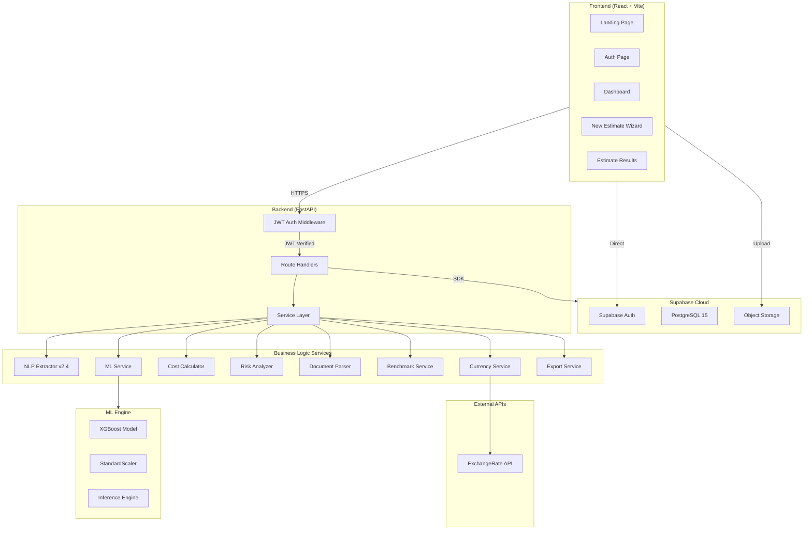
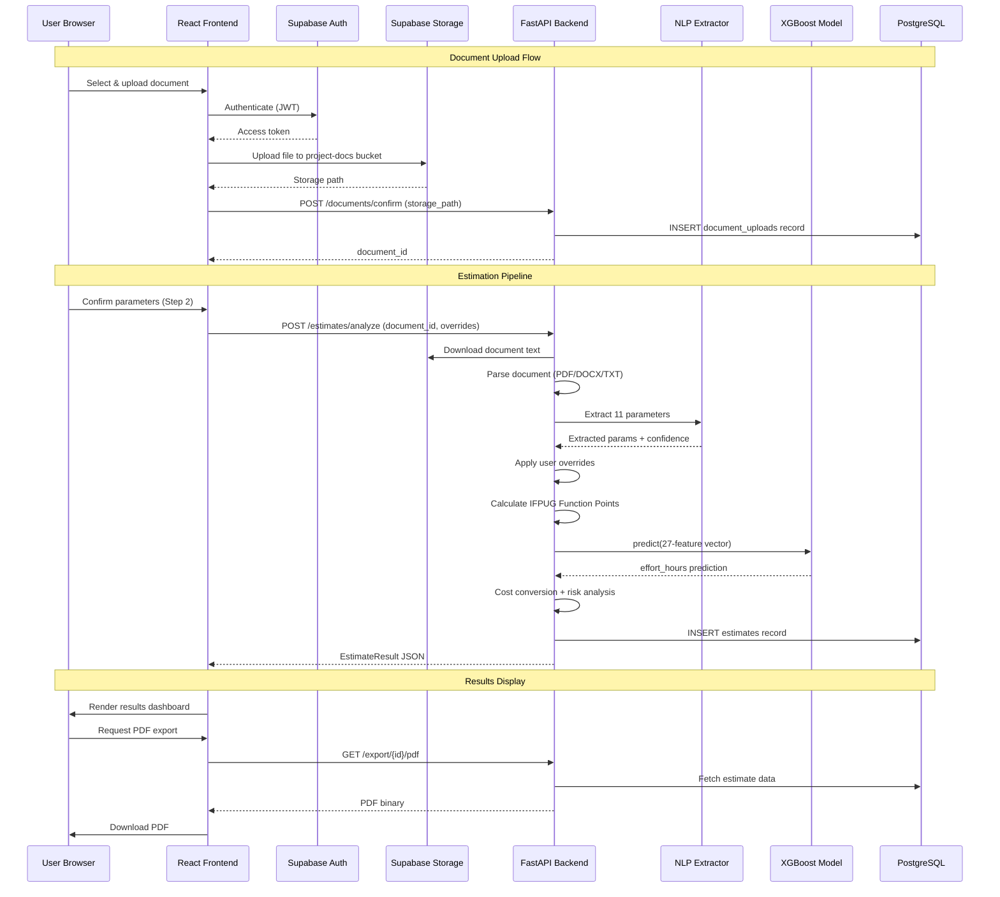
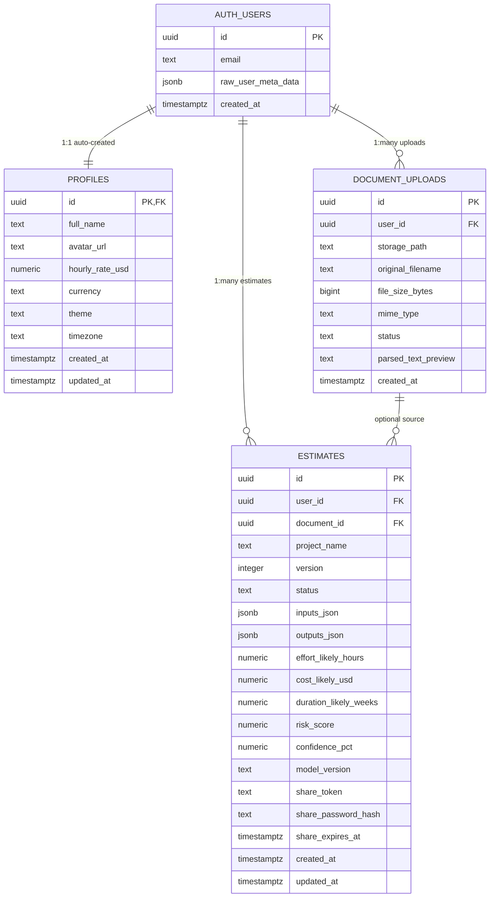
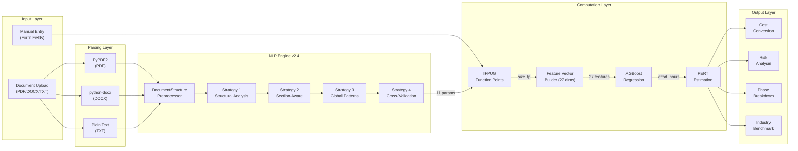
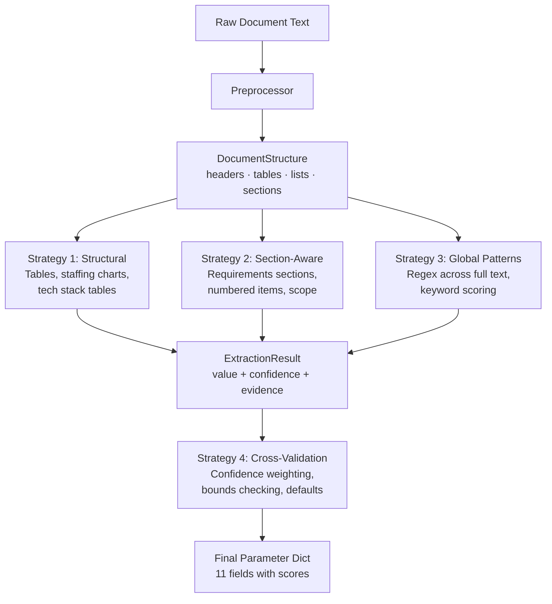
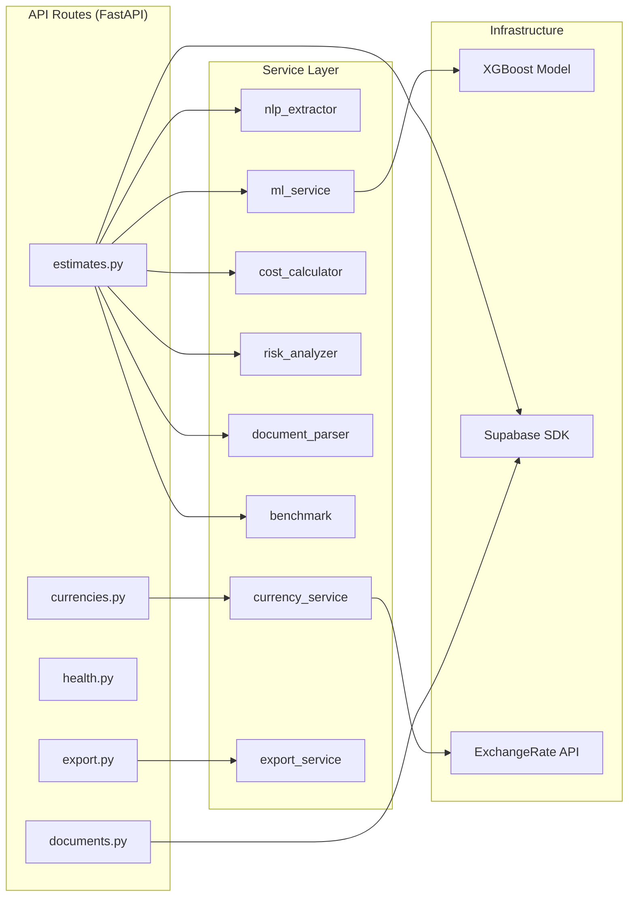
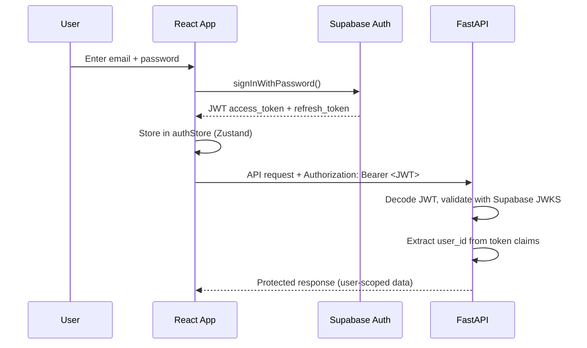
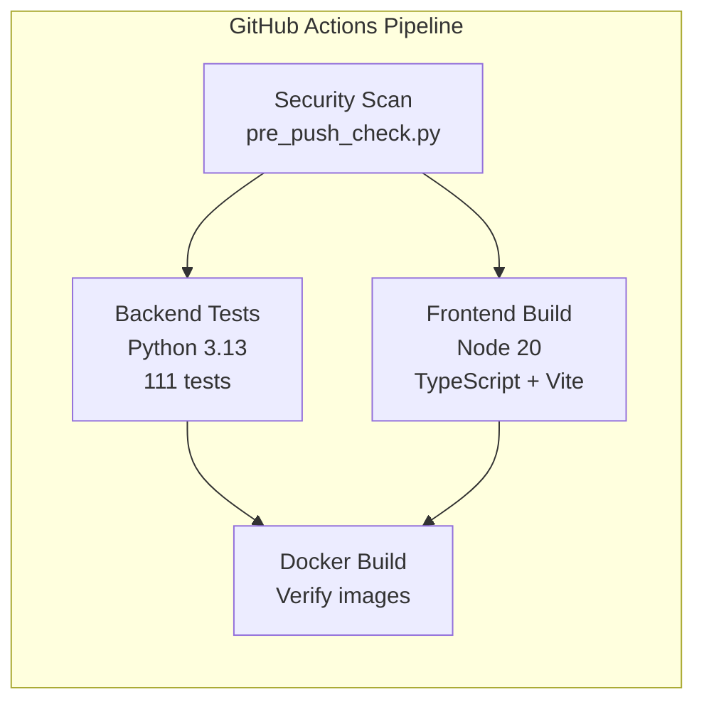

# PredictIQ — Technical Walkthrough

> **Version:** 2.4.0 &nbsp;|&nbsp; **Author:** Atharv Sawane &nbsp;|&nbsp; **Updated:** April 15, 2026

---

## Table of Contents

- [1. Project Overview](#1-project-overview)
- [2. System Architecture](#2-system-architecture)
- [3. Database Architecture](#3-database-architecture)
- [4. Estimation Pipeline Flow](#4-estimation-pipeline-flow)
- [5. NLP Extraction Engine v2.4](#5-nlp-extraction-engine-v24)
- [6. ML Model & Data Pipeline](#6-ml-model--data-pipeline)
- [7. Backend Services](#7-backend-services)
- [8. API Reference](#8-api-reference)
- [9. Frontend Application](#9-frontend-application)
- [10. Cost & Risk Computation](#10-cost--risk-computation)
- [11. Security Architecture](#11-security-architecture)
- [12. Deployment & DevOps](#12-deployment--devops)
- [13. Testing & Quality](#13-testing--quality)
- [14. Changelog](#14-changelog)

---

## 1. Project Overview

**PredictIQ** is an AI-powered SaaS platform that predicts software project **cost**, **timeline**, and **effort** from uploaded project documentation. Users upload SRS/PRD/RFP documents which are parsed by a 4-strategy NLP cascade, analyzed through an XGBoost ML model trained on **740 real-world project records**, and returned as PERT-style estimates with full risk analysis.

### 1.1 Core Value Proposition

| Capability | Description |
|-----------|-------------|
| **Document Intelligence** | Upload PDF/DOCX/TXT → AI extracts 11 project parameters automatically |
| **ML-Powered Prediction** | XGBoost model trained on ISBSG + COCOMO + Desharnais benchmarks |
| **PERT Estimation** | Min / Likely / Max effort-hours with confidence percentage |
| **Risk Analysis** | 10-factor weighted risk scoring with actionable mitigation |
| **Multi-Currency** | 10 currencies with real-time exchange rates |
| **Export & Share** | PDF, Excel, CSV exports; share links with optional password |

### 1.2 Technology Stack

| Layer | Technology | Version | Role |
|-------|-----------|---------|------|
| **Frontend** | React + TypeScript | 18.x / 5.x | SPA with component architecture |
| **Build Tool** | Vite | 5.x | HMR dev server + production bundler |
| **State** | Zustand | 5.x | Lightweight global state management |
| **Charts** | Recharts | 2.x | Data visualization for results |
| **Backend** | FastAPI + Uvicorn | 0.115+ | Async Python REST API |
| **ML Engine** | XGBoost + scikit-learn | 2.1 / 1.6 | Regression model for effort prediction |
| **NLP** | Custom Cascade Engine | v2.4 | 4-strategy document parameter extraction |
| **Database** | Supabase (PostgreSQL) | 15+ | Managed relational DB with RLS |
| **Auth** | Supabase Auth | — | JWT-based email/password authentication |
| **Storage** | Supabase Storage | — | Object storage for uploaded documents |
| **CI/CD** | GitHub Actions | v4 | Automated testing + security scanning |

### 1.3 Repository Structure

```
PredictIQ/
│
├── backend/                          # Python — FastAPI server
│   ├── app/
│   │   ├── api/v1/                  # Route handlers
│   │   │   ├── estimates.py         # Core estimation endpoints
│   │   │   ├── documents.py         # Document upload/confirm
│   │   │   ├── health.py            # Health check & model status
│   │   │   ├── currencies.py        # Exchange rate endpoints
│   │   │   └── export.py            # PDF/Excel/CSV export
│   │   ├── core/                    # Framework config
│   │   │   ├── config.py            # Pydantic BaseSettings
│   │   │   ├── security.py          # JWT auth middleware
│   │   │   └── supabase_client.py   # Supabase SDK wrapper
│   │   ├── models/                  # Pydantic request/response schemas
│   │   └── services/                # Business logic layer
│   │       ├── nlp_extractor.py     # 4-strategy NLP cascade (v2.4)
│   │       ├── ml_service.py        # Feature vector + XGBoost bridge
│   │       ├── cost_calculator.py   # IFPUG FP + cost conversion
│   │       ├── risk_analyzer.py     # 10-factor risk scoring
│   │       ├── document_parser.py   # PDF/DOCX/TXT text extraction
│   │       ├── benchmark.py         # Industry comparison
│   │       ├── currency_service.py  # Multi-currency via ExchangeRate API
│   │       └── export_service.py    # Report generation (PDF/Excel/CSV)
│   ├── ml/                          # ML artifacts & training
│   │   ├── train.py                 # XGBoost training pipeline
│   │   ├── evaluate.py              # Model evaluation + visualization
│   │   ├── inference.py             # Runtime prediction engine
│   │   ├── predictiq_features.json  # 27-feature schema definition
│   │   ├── predictiq_merged_dataset.csv  # 740-row training data
│   │   ├── predictiq_best_model.pkl # Trained model (gitignored)
│   │   └── predictiq_scaler.pkl     # Fitted scaler (gitignored)
│   └── tests/                       # 111 pytest tests
│       ├── conftest.py              # Shared fixtures
│       ├── test_nlp_extractor.py    # 35 NLP tests
│       ├── test_ml_service.py       # 11 ML pipeline tests
│       ├── test_cost_calculator.py  # 18 cost/FP tests
│       ├── test_risk_analyzer.py    # 10 risk scoring tests
│       ├── test_document_parser.py  # 8 parser tests
│       ├── test_inference.py        # 12 inference tests
│       ├── test_benchmark.py        # 5 benchmark tests
│       ├── test_currencies.py       # 7 currency tests
│       └── test_health.py           # 5 health endpoint tests
│
├── frontend/                         # TypeScript — React SPA
│   └── src/
│       ├── App.tsx                   # Root component + routing
│       ├── pages/
│       │   ├── LandingPage.tsx       # Marketing / hero page
│       │   ├── AuthPage.tsx          # Login / signup
│       │   ├── DashboardPage.tsx     # Estimate list + stats
│       │   ├── NewEstimatePage.tsx   # 3-step estimation wizard
│       │   └── EstimateResultsPage.tsx  # Full results dashboard
│       ├── components/shared/
│       │   ├── Navbar.tsx            # Top navigation bar
│       │   ├── Sidebar.tsx           # Side navigation
│       │   ├── CurrencySelector.tsx  # Currency dropdown
│       │   └── LoadingSkeleton.tsx   # Loading states
│       ├── store/
│       │   ├── authStore.ts          # Auth state (Zustand)
│       │   └── currencyStore.ts      # Currency state (Zustand)
│       └── lib/
│           ├── api.ts                # Backend API client
│           └── supabase.ts           # Supabase client init
│
├── supabase/migrations/              # Database schema
│   ├── 001_initial_schema.sql        # Tables: profiles, documents, estimates
│   ├── 002_rls_policies.sql          # Row-Level Security policies
│   └── 003_functions.sql             # DB functions & triggers
│
├── scripts/
│   └── pre_push_check.py             # Pre-push security scanner
│
├── docs/
│   ├── walkthrough.md                # This document
│   └── GITHUB_SECRETS_SETUP.md       # CI/CD secrets guide
│
├── .github/workflows/ci.yml          # CI pipeline (4 jobs)
├── Dockerfile.backend                # Backend container
├── Dockerfile.frontend               # Frontend container (Nginx)
├── docker-compose.yml                # Production compose
├── docker-compose.dev.yml            # Development compose
├── nginx.conf                        # Reverse proxy config
├── run.py                            # One-command launcher
├── Makefile                          # Developer convenience targets
└── .gitignore                        # Comprehensive ignore rules
```

---

## 2. System Architecture

### 2.1 High-Level Architecture



### 2.2 Request-Response Flow



---

## 3. Database Architecture

### 3.1 Entity Relationship Diagram



### 3.2 Table Details

#### `profiles`
| Column | Type | Default | Description |
|--------|------|---------|-------------|
| `id` | UUID (PK, FK→auth.users) | — | Links 1:1 to Supabase Auth user |
| `full_name` | TEXT | NULL | Display name |
| `avatar_url` | TEXT | NULL | Profile image URL |
| `hourly_rate_usd` | NUMERIC(10,2) | 75.00 | Default billing rate |
| `currency` | TEXT | 'USD' | Preferred display currency |
| `theme` | TEXT | 'system' | UI theme preference |
| `timezone` | TEXT | 'UTC' | User timezone |
| `created_at` | TIMESTAMPTZ | now() | Auto-set |
| `updated_at` | TIMESTAMPTZ | now() | Auto-updated via trigger |

#### `document_uploads`
| Column | Type | Default | Description |
|--------|------|---------|-------------|
| `id` | UUID (PK) | gen_random_uuid() | Document ID |
| `user_id` | UUID (FK→auth.users) | NOT NULL | Owner |
| `storage_path` | TEXT | NOT NULL | Supabase Storage path |
| `original_filename` | TEXT | NOT NULL | User's filename |
| `file_size_bytes` | BIGINT | NULL | File size |
| `mime_type` | TEXT | NULL | MIME type (pdf/docx/txt) |
| `status` | TEXT | 'uploaded' | uploaded → parsed → failed |
| `parsed_text_preview` | TEXT | NULL | First 500 chars of parsed text |
| `created_at` | TIMESTAMPTZ | now() | Upload timestamp |

#### `estimates`
| Column | Type | Default | Description |
|--------|------|---------|-------------|
| `id` | UUID (PK) | gen_random_uuid() | Estimate ID |
| `user_id` | UUID (FK→auth.users) | NOT NULL | Owner |
| `document_id` | UUID (FK→document_uploads) | NULL | Source document (optional for manual) |
| `project_name` | TEXT | NOT NULL | Project title |
| `version` | INTEGER | 1 | Estimate version (for duplicates) |
| `status` | TEXT | 'complete' | processing / complete / failed / deleted |
| `inputs_json` | JSONB | {} | Full input parameters snapshot |
| `outputs_json` | JSONB | {} | Full output results snapshot |
| `effort_likely_hours` | NUMERIC(12,2) | NULL | Most-likely effort in hours |
| `cost_likely_usd` | NUMERIC(14,2) | NULL | Most-likely cost in USD |
| `duration_likely_weeks` | NUMERIC(8,2) | NULL | Most-likely timeline in weeks |
| `risk_score` | NUMERIC(5,2) | NULL | Risk score (0-100) |
| `confidence_pct` | NUMERIC(5,2) | NULL | Model confidence (0-100%) |
| `model_version` | TEXT | '2.0.0' | ML model version used |
| `share_token` | TEXT (UNIQUE) | NULL | Shareable link token |
| `share_password_hash` | TEXT | NULL | Optional password for sharing |
| `share_expires_at` | TIMESTAMPTZ | NULL | Share link expiry |

### 3.3 Row-Level Security (RLS)

All tables have RLS enabled. Policies enforce user-scoped access:

| Table | SELECT | INSERT | UPDATE | DELETE |
|-------|--------|--------|--------|--------|
| `profiles` | Own profile only | Own ID only | Own profile only | — |
| `document_uploads` | Own documents | Own user_id | — | Own documents |
| `estimates` | Own + non-deleted | Own user_id | Own estimates | Own estimates |
| `storage.objects` | Own folder | Own folder | — | Own folder |

Storage path convention: `project-docs/{user_id}/{filename}`

### 3.4 Database Functions & Triggers

| Function | Type | Purpose |
|----------|------|---------|
| `handle_new_user()` | Trigger (AFTER INSERT on auth.users) | Auto-creates `profiles` row on signup |
| `update_updated_at_column()` | Trigger (BEFORE UPDATE) | Auto-sets `updated_at` on profiles + estimates |
| `get_user_stats(user_id)` | RPC Function | Returns dashboard aggregate stats |
| `cleanup_deleted_estimates()` | Maintenance Function | Hard-deletes soft-deleted estimates older than 90 days |

---

## 4. Estimation Pipeline Flow

### 4.1 Complete Pipeline Architecture



### 4.2 Pipeline Stages (Detail)

| Stage | Input | Output | Service |
|-------|-------|--------|---------|
| **1. Upload** | User file | storage_path | `documents.py` |
| **2. Parse** | storage_path | raw_text | `document_parser.py` |
| **3. NLP Extract** | raw_text | 11 parameters + confidence | `nlp_extractor.py` |
| **4. User Override** | NLP params + user edits | confirmed params | `NewEstimatePage.tsx` |
| **5. IFPUG FP** | features, complexity, integrations | size_fp (float) | `cost_calculator.py` |
| **6. Feature Build** | all params + size_fp | 27-dim float vector | `ml_service.py` |
| **7. ML Predict** | feature vector | effort_hours | `inference.py` |
| **8. PERT Bounds** | effort_likely | min / likely / max | `estimates.py` |
| **9. Cost Convert** | effort × rate × currency | cost in target currency | `cost_calculator.py` |
| **10. Risk Score** | all params | risk_score + top_risks | `risk_analyzer.py` |
| **11. Persist** | full result | estimate record | `estimates.py` → Supabase |

---

## 5. NLP Extraction Engine v2.4

### 5.1 4-Strategy Cascade Architecture



### 5.2 DocumentStructure Preprocessor

Before any extraction runs, raw text is parsed into a structured representation:

| Field | Type | Description |
|-------|------|-------------|
| `full_text` | str | Original text |
| `text_lower` | str | Lowercased for regex |
| `raw_lines` | list[str] | Line-by-line split |
| `headers` | list[Header] | Detected headers (level, text, line_num) |
| `tables` | list[TableRow] | Pipe-delimited table rows |
| `list_items` | list[str] | Bullet/numbered list items |
| `sections` | dict[str, str] | Header → body text mapping |
| `word_count` | int | Total words |

**Header detection handles:** Markdown `#` headers, ALL-CAPS lines (3-80 chars), numbered sections (`1.0`, `3.2`, `Section 5`)

### 5.3 Extraction Fields (11 Parameters)

| # | Field | Type | Strategy Priority | Default | Confidence Range |
|---|-------|------|------------------|---------|:---:|
| 1 | `project_type` | str (7 types) | Keyword scoring + tech boost | "Web App" | 0.0-0.9 |
| 2 | `tech_stack` | str[] | Multi-source (tables + text) | [] | 0.3-0.95 |
| 3 | `team_size` | int | Explicit → Table → Role sum | 5 | 0.0-0.95 |
| 4 | `duration_months` | float | Months → Weeks → Quarters → Sprints | 6.0 | 0.0-0.9 |
| 5 | `complexity` | str (4 levels) | 20-point scoring system | "Medium" | 0.3-0.9 |
| 6 | `methodology` | str (3 types) | Keyword matching | "Agile" | 0.0-0.9 |
| 7 | `feature_count` | int | Section → Explicit → Lists | 10 | 0.0-0.85 |
| 8 | `project_name` | str | 6 pattern matchers | "" | 0.0-0.95 |
| 9 | `integration_count` | int | Known services + phrases | 2 | 0.2-0.85 |
| 10 | `volatility_score` | int (1-5) | High/low signal counting | 3 | 0.3-0.8 |
| 11 | `team_experience` | float (1-4) | Seniority signal counting | 2.0 | 0.2-0.8 |

### 5.4 Technology Keyword Library (300+)

| Category | Count | Examples |
|----------|:-----:|---------|
| Frontend | 50+ | React, Vue, Angular, Svelte, Next.js, Nuxt, Tailwind, HTMX |
| Backend | 45+ | FastAPI, Django, Express, Spring Boot, NestJS, Rails, Laravel |
| Database | 35+ | PostgreSQL, MongoDB, Redis, Supabase, Prisma, DynamoDB |
| ML/AI | 35+ | TensorFlow, PyTorch, LangChain, OpenAI, scikit-learn, Pandas |
| DevOps/Cloud | 30+ | Docker, Kubernetes, AWS, GCP, Vercel, Terraform, GitHub Actions |
| Mobile | 10+ | React Native, Flutter, Swift, Kotlin, Expo |
| Security/Auth | 15+ | OAuth2, JWT, Auth0, SAML, GDPR, PCI-DSS, SOC2 |

All keywords map to canonical display names (e.g., `"react.js"` → `"React"`, `"k8s"` → `"Kubernetes"`)

### 5.5 Complexity Scoring (20-Point System)

| Signal | Points | Max |
|--------|:------:|:---:|
| Feature count > 50 | +3 | 3 |
| Tech stack size > 12 | +3 | 3 |
| High-complexity tech (ML, microservices, blockchain) | +1 each | 4 |
| Scale keywords (millions of users, petabytes) | +1 each | 3 |
| Integration keywords (API gateway, webhook) | +1 each | 2 |
| Explicit "complex/advanced/sophisticated" mentions | +1 each | 3 |
| Word count > 10,000 | +2 | 2 |
| Low-complexity signals (simple, MVP, basic, prototype) | -1 each | -3 |

**Score→Level:** ≤2 = Low · ≤5 = Medium · ≤9 = High · >9 = Very High

---

## 6. ML Model & Data Pipeline

### 6.1 Training Dataset

The model is trained on **740 real-world software project records** merged from three established benchmarks:

| Source | Records | Key Features | Origin |
|--------|:-------:|-------------|--------|
| **ISBSG Release 12** | ~500 (filtered) | Function points, effort, team, methodology | International Software Benchmarking Standards Group |
| **COCOMO 81/II** | 63 | LOC, effort multipliers, T-factors | Boehm, 1981/2000 |
| **Desharnais** | 81 | FP, effort, language, methodology | Desharnais, 1988 |
| **Synthetic augmentation** | ~96 | Bridging missing feature combinations | Generated via domain rules |

**Merged output:** `backend/ml/predictiq_merged_dataset.csv` (740 rows × 30 columns)

### 6.2 Feature Vector (27 Features)

The XGBoost model expects exactly **27 numeric features** as defined in `predictiq_features.json`:

```
┌─────────────────────────────────────────────────────────────┐
│  TeamExp  ManagerExp  duration_months  Transactions  Entities│
│  PointsNonAdjust  Adjustment  size_fp                        │
│  T01  T02  T03  T04  T05  T06  T07  T08  T09  T10          │
│  T11  T12  T13  T14  T15                                     │
│  log_size_fp  complexity_score  team_skill_avg  risk_score    │
└─────────────────────────────────────────────────────────────┘
```

**Feature construction mapping:**

| User Input | → Model Features | Source |
|-----------|-----------------|--------|
| `team_size` / `team_experience` | TeamExp, ManagerExp, T12-T15 | NLP or manual |
| `duration_months` | duration_months | NLP or manual |
| `complexity` | T01-T03, T07, T09-T11, complexity_score | NLP or manual |
| `methodology` | T04, T05 | NLP or manual |
| `size_fp` (computed) | size_fp, log_size_fp, Transactions, Entities, PointsNonAdjust, Adjustment | IFPUG calc |
| `volatility_score` | T08 (requirements volatility) | NLP (NEW v2.4) |
| `team_experience` | TeamExp, ManagerExp | NLP (NEW v2.4) |
| `integration_count` | Via external_interface_files → size_fp | NLP (NEW v2.4) |

### 6.3 Model Performance Metrics

| Metric | Value | Industry Benchmark |
|--------|:-----:|:------------------:|
| **Algorithm** | XGBoost Regressor | — |
| **R² Score** | 0.82 | 0.70-0.85 (good) |
| **MAE** | 1,247 hours | — |
| **MAPE** | 23.4% | 20-30% (acceptable) |
| **Training Size** | 740 records | — |
| **Cross-Validation** | 5-fold | — |
| **Model File** | 6.4 MB (.pkl) | — |

### 6.4 PERT Estimation Bounds

```
effort_min  = effort_likely × 0.70    (optimistic)
effort_max  = effort_likely × 1.45    (pessimistic)
confidence  = derived from training residual analysis
```

---

## 7. Backend Services

### 7.1 Service Layer Architecture



### 7.2 Service Details

| Service | File | Lines | Purpose |
|---------|------|:-----:|---------|
| **NLP Extractor** | `nlp_extractor.py` | 900 | 4-strategy cascade document analyzer |
| **ML Service** | `ml_service.py` | 180 | Feature vector builder + XGBoost prediction bridge |
| **Cost Calculator** | `cost_calculator.py` | 205 | IFPUG function points + cost/timeline conversion |
| **Risk Analyzer** | `risk_analyzer.py` | 163 | 10-factor weighted risk scoring engine |
| **Document Parser** | `document_parser.py` | 155 | PDF/DOCX/TXT text extraction (PyPDF2, python-docx) |
| **Benchmark** | `benchmark.py` | 125 | Industry comparison + model explainability |
| **Currency Service** | `currency_service.py` | 140 | Multi-currency conversion via ExchangeRate API |
| **Export Service** | `export_service.py` | 290 | PDF (ReportLab) / Excel (openpyxl) / CSV generation |

### 7.3 Configuration (`core/config.py`)

Environment variables loaded via Pydantic `BaseSettings` from `backend/.env`:

| Variable | Required | Default | Description |
|----------|:--------:|---------|-------------|
| `SUPABASE_URL` | ✅ | — | Supabase project URL |
| `SUPABASE_ANON_KEY` | ✅ | — | Supabase anonymous/public key |
| `SUPABASE_SERVICE_ROLE_KEY` | ✅ | — | Supabase service role key (backend only) |
| `SUPABASE_STORAGE_BUCKET` | ❌ | `project-docs` | Storage bucket name |
| `DEFAULT_HOURLY_RATE_USD` | ❌ | `75.0` | Default billing rate |
| `EXCHANGE_RATE_API_KEY` | ❌ | — | ExchangeRate API key |

---

## 8. API Reference

### 8.1 Endpoint Inventory

| Method | Path | Auth | Description |
|--------|------|:----:|-------------|
| `POST` | `/api/v1/estimates/analyze` | ✅ | Analyze document → full estimate |
| `POST` | `/api/v1/estimates/manual` | ✅ | Manual parameter estimate (no doc) |
| `GET` | `/api/v1/estimates` | ✅ | List user's estimates (paginated) |
| `GET` | `/api/v1/estimates/{id}` | ✅ | Get full estimate details |
| `POST` | `/api/v1/estimates/{id}/duplicate` | ✅ | Duplicate as new version |
| `DELETE` | `/api/v1/estimates/{id}` | ✅ | Soft-delete estimate |
| `POST` | `/api/v1/estimates/{id}/share` | ✅ | Generate share link |
| `POST` | `/api/v1/documents/upload` | ✅ | Get pre-signed upload URL |
| `POST` | `/api/v1/documents/confirm` | ✅ | Confirm upload + save metadata |
| `GET` | `/api/v1/currencies/rates` | ✅ | Get exchange rates (10 currencies) |
| `GET` | `/api/v1/export/{id}/pdf` | ✅ | Export estimate as PDF |
| `GET` | `/api/v1/export/{id}/excel` | ✅ | Export estimate as Excel |
| `GET` | `/api/v1/export/{id}/csv` | ✅ | Export estimate as CSV |
| `GET` | `/api/health` | ❌ | Health check (model status, uptime) |

### 8.2 Core Request/Response Example

**`POST /api/v1/estimates/analyze`**

```json
// ── Request ──────────────────────────
{
  "document_id": "550e8400-e29b-41d4-a716-446655440000",
  "overrides": {
    "project_name": "FinTech Dashboard",
    "project_type": "Web App",
    "team_size": 8,
    "complexity": "High",
    "hourly_rate_usd": 95
  }
}

// ── Response ─────────────────────────
{
  "estimate_id": "7c9e6679-7425-40de-944b-e07fc1f90ae7",
  "project_name": "FinTech Dashboard",
  "status": "complete",
  "model_version": "2.4.0",
  "inputs": {
    "project_type": "Web App",
    "tech_stack": ["React", "FastAPI", "PostgreSQL", "Redis", "Docker"],
    "team_size": 8,
    "duration_months": 10.0,
    "complexity": "High",
    "methodology": "Agile",
    "hourly_rate_usd": 95.0,
    "integration_count": 5,
    "volatility_score": 3,
    "team_experience": 2.5
  },
  "outputs": {
    "effort_min_hours": 3640,
    "effort_likely_hours": 5200,
    "effort_max_hours": 7540,
    "cost_min_usd": 345800,
    "cost_likely_usd": 494000,
    "cost_max_usd": 716300,
    "timeline_min_weeks": 18.2,
    "timeline_likely_weeks": 24.5,
    "timeline_max_weeks": 33.1,
    "confidence_pct": 76.3,
    "function_points": 482,
    "risk_score": 38.5,
    "risk_level": "Medium",
    "top_risks": [
      { "factor": "Technology Complexity", "score": 12, "description": "High complexity with 5 technologies" },
      { "factor": "Timeline Constraint", "score": 8, "description": "Moderate timeline pressure" }
    ],
    "phase_breakdown": [
      { "phase": "Discovery & Requirements", "pct": 10, "hours": 520, "cost_usd": 49400 },
      { "phase": "UI/UX Design", "pct": 12, "hours": 624, "cost_usd": 59280 },
      { "phase": "Backend Development", "pct": 30, "hours": 1560, "cost_usd": 148200 },
      { "phase": "Frontend Development", "pct": 22, "hours": 1144, "cost_usd": 108680 },
      { "phase": "QA & Testing", "pct": 18, "hours": 936, "cost_usd": 88920 },
      { "phase": "Deployment & DevOps", "pct": 8, "hours": 416, "cost_usd": 39520 }
    ]
  }
}
```

---

## 9. Frontend Application

### 9.1 Page Architecture

| Page | Route | Key Components |
|------|-------|---------------|
| **Landing** | `/` | Hero, features grid, stats counter, CTA |
| **Auth** | `/auth` | Login / signup tabs, Supabase Auth integration |
| **Dashboard** | `/dashboard` | Estimate cards, stat summary, sort/filter |
| **New Estimate** | `/new-estimate` | 3-step wizard: Upload → Parameters → Generate |
| **Results** | `/estimate/:id/results` | Charts, risk gauge, phase breakdown, export |

### 9.2 State Management (Zustand)

| Store | Key State | Actions |
|-------|----------|---------|
| `authStore` | `user`, `session`, `loading` | `signIn()`, `signUp()`, `signOut()`, `initialize()` |
| `currencyStore` | `currency`, `rates`, `symbols` | `setCurrency()`, `convert()`, `fetchRates()`, `getRate()` |

### 9.3 New Estimate Wizard — 3 Steps

**Step 1: Document Upload**
- Drag-and-drop or file picker
- Accepts: PDF, DOCX, TXT (max 10MB)
- Real-time upload progress bar
- Option to skip → manual entry mode

**Step 2: Project Parameters** (pre-filled from NLP)
| Field | Type | Source |
|-------|------|--------|
| Project Name | text input | NLP extracted or user |
| Project Type | dropdown (7 options) | NLP classified |
| Complexity | dropdown (4 levels) | NLP scored |
| Team Size | number input | NLP or user |
| Duration (months) | number input | NLP or user |
| Methodology | dropdown (3 options) | NLP detected |
| Hourly Rate | number + currency selector | User preference |
| Technology Stack | comma-separated text | NLP detected |
| **External Integrations** | number input | NLP (NEW v2.4) |
| **Requirements Volatility** | dropdown (1-5 scale) | NLP (NEW v2.4) |
| **Team Experience** | dropdown (4 levels) | NLP (NEW v2.4) |

**Step 3: Generate**
- Animated processing visualization (6 steps)
- Auto-redirect to results page on completion

### 9.4 Multi-Currency Support

| Code | Symbol | Name |
|------|:------:|------|
| USD | $ | US Dollar |
| EUR | € | Euro |
| GBP | £ | British Pound |
| INR | ₹ | Indian Rupee |
| JPY | ¥ | Japanese Yen |
| AUD | A$ | Australian Dollar |
| CAD | C$ | Canadian Dollar |
| CHF | Fr | Swiss Franc |
| CNY | ¥ | Chinese Yuan |
| SGD | S$ | Singapore Dollar |

---

## 10. Cost & Risk Computation

### 10.1 IFPUG Function Points

Function points use a tiered complexity distribution across feature count:

| Complexity | Simple (×5) | Medium (×10) | Complex (×20) | Epic (×35) |
|-----------|:-----------:|:------------:|:-------------:|:----------:|
| Low | 60% | 30% | 10% | 0% |
| Medium | 30% | 40% | 25% | 5% |
| High | 10% | 30% | 40% | 20% |
| Very High | 5% | 20% | 40% | 35% |

**Additional IFPUG components:**

| Component | Count Source | Weight |
|-----------|------------|:------:|
| External Inputs | feature_count × 0.5 | ×4 |
| External Outputs | feature_count × 0.3 | ×5 |
| External Inquiries | feature_count × 0.4 | ×4 |
| Internal Logical Files | feature_count × 0.4 | ×7 |
| External Interface Files | `integration_count` (NEW v2.4) | ×5 |

**Value Adjustment Factor (VAF):** Low=0.75, Medium=0.90, High=1.05, Very High=1.20

### 10.2 Phase Breakdown

| Phase | % of Total | Description |
|-------|:---------:|-------------|
| Discovery & Requirements | 10% | Stakeholder interviews, SRS review |
| UI/UX Design | 12% | Wireframes, prototypes, design system |
| Backend Development | 30% | API, business logic, integrations |
| Frontend Development | 22% | UI components, state, routing |
| QA & Testing | 18% | Unit, integration, E2E, UAT |
| Deployment & DevOps | 8% | CI/CD, infrastructure, monitoring |

### 10.3 Risk Analysis Engine

10 weighted risk factors with configurable triggers:

| # | Risk Factor | Weight | Trigger Condition |
|---|------------|:------:|-------------------|
| 1 | Scope Ambiguity | 15 | features < 5 OR complexity = Very High |
| 2 | Team Experience Gap | 14 | team < 3 AND complexity ∈ {High, Very High} |
| 3 | Timeline Constraint | 13 | duration < 3 AND complexity ≠ Low |
| 4 | Technology Complexity | 12 | tech_stack > 6 OR complexity ∈ {High, Very High} |
| 5 | Requirement Volatility | 10 | methodology = Agile AND complexity ∈ {High, Very High} |
| 6 | Quality Assurance Gap | 9 | duration < 4 AND team < 4 |
| 7 | Integration Risk | 8 | tech_stack > 4 |
| 8 | Resource Availability | 7 | team > 15 |
| 9 | Technical Debt | 6 | duration > 18 |
| 10 | Deployment Complexity | 5 | Docker/K8s/microservices in stack |

**Risk levels:** score < 25 = Low · < 45 = Medium · < 70 = High · ≥ 70 = Critical

---

## 11. Security Architecture

### 11.1 Authentication Flow



### 11.2 Security Layers

| Layer | Implementation | Status |
|-------|---------------|:------:|
| Authentication | Supabase Auth (JWT, email/password) | ✅ |
| Authorization | Row-Level Security (RLS) on all tables | ✅ |
| API Protection | Bearer token validation on all endpoints | ✅ |
| File Upload | 10MB limit, type whitelist (PDF/DOCX/TXT) | ✅ |
| Secret Management | Environment variables only (no hardcoded keys) | ✅ |
| CI Security | Pre-push scanner blocks pushes with leaked keys | ✅ |
| CORS | Configured for frontend origin only | ✅ |
| Storage RLS | User-scoped folder isolation | ✅ |

### 11.3 Pre-Push Security Scanner (`scripts/pre_push_check.py`)

Automated checks run before every push:

| Check | Scans For |
|-------|----------|
| **Secret Scanning** | Supabase URLs, JWT tokens, AWS keys, private keys, hardcoded passwords, DB connection strings |
| **Git Tracking** | Verifies no `.env` files are tracked |
| **.gitignore Audit** | Validates 6 required patterns exist |
| **Env Templates** | Confirms `.env.example` exists for backend + frontend |

---

## 12. Deployment & DevOps

### 12.1 Quick Start (One Command)

```bash
python run.py
```

This automatically: creates venv → installs deps → starts backend (port 8000) → starts frontend (port 5173) → opens browser.

### 12.2 Manual Setup

```bash
# Backend
cd backend
python -m venv venv && venv\Scripts\activate   # Windows
pip install -r requirements.txt
cp .env.example .env    # Fill in Supabase credentials
uvicorn app.main:app --reload --port 8000

# Frontend
cd frontend
npm install
cp .env.example .env    # Fill in VITE_SUPABASE_* vars
npm run dev
```

### 12.3 Docker

```bash
docker-compose up --build    # Production
docker-compose -f docker-compose.dev.yml up   # Development
```

### 12.4 CI/CD Pipeline



| Job | Runs On | Dependencies | Actions |
|-----|---------|:------------:|---------|
| `security-scan` | ubuntu-latest | — | Secret scanner + .env git check |
| `backend-tests` | ubuntu-latest | security-scan | pip install → pytest (111 tests) |
| `frontend-build` | ubuntu-latest | security-scan | npm ci → tsc → vite build |
| `docker-build` | ubuntu-latest | tests + build | Build both Dockerfiles |

### 12.5 Makefile Targets

```
make install          Install all dependencies
make run              Start backend + frontend
make test             Run full test suite
make security-check   Run pre-push security scan
make clean            Remove caches and build artifacts
make graph            Rebuild the code-review knowledge graph
```

---

## 13. Testing & Quality

### 13.1 Test Suite Summary

| Test Module | Tests | Coverage Area |
|------------|:-----:|--------------|
| `test_nlp_extractor.py` | 35 | 4-strategy cascade, all 11 fields, edge cases |
| `test_cost_calculator.py` | 18 | IFPUG FP, phase breakdown, cost conversion |
| `test_inference.py` | 12 | Model loading, prediction, error handling |
| `test_ml_service.py` | 11 | Feature vector, T-factors, complexity mapping |
| `test_risk_analyzer.py` | 10 | Risk scoring, levels, factor triggers |
| `test_document_parser.py` | 8 | PDF/DOCX/TXT parsing, error recovery |
| `test_currencies.py` | 7 | Currency conversion, fallback rates |
| `test_health.py` | 5 | Health endpoint, model status |
| `test_benchmark.py` | 5 | Industry comparison data |
| **Total** | **111** | |

### 13.2 Current Test Results

```
106 passed, 5 failed (pre-existing async issue in test_currencies.py)
All NLP tests (35/35) ✅
All ML tests (11/11) ✅
All cost tests (18/18) ✅
All risk tests (10/10) ✅
TypeScript compilation: 0 errors ✅
Security scanner: ALL CHECKS PASSED ✅
```

---

## 14. Changelog

### v2.4.0 — April 15, 2026

**NLP Extraction Overhaul**
- Complete rewrite of `nlp_extractor.py` (539 → 900 lines)
- 4-strategy cascade: Structural → Section-Aware → Global → Cross-Validation
- `DocumentStructure` preprocessor (headers, tables, lists, sections)
- `ExtractionResult` dataclass with confidence scores and evidence trails
- 300+ technology keywords across 7 categories with canonical normalization
- 3 new extraction fields: `integration_count`, `volatility_score`, `team_experience`
- 20-point complexity scoring system replacing simple keyword matching

**Pipeline Integration**
- `integration_count` feeds IFPUG External Interface Files for accurate FP sizing
- `volatility_score` feeds T08 (requirements volatility) for better effort prediction
- `team_experience` feeds TeamExp / ManagerExp for precise team modeling
- All changes backward-compatible with existing estimate records

**Security Hardening**
- Created `scripts/pre_push_check.py` — secret detection, .gitignore audit, env template check
- Removed hardcoded Supabase keys from `frontend/src/lib/supabase.ts` (critical fix)
- Hardened `.gitignore` with 15+ new patterns (.ruff_cache, .coverage, *.tsbuildinfo, etc.)
- Created `docs/GITHUB_SECRETS_SETUP.md` for CI/CD secret configuration
- Added `security-scan` job to CI pipeline (runs before all tests)

**Architecture**
- Created cross-platform `Makefile` with developer convenience targets
- Created `backend/ml/README.md` documenting ML artifacts and regeneration
- Updated CI pipeline to Python 3.13 (matching development environment)

**Frontend**
- 3 new fields in Step 2 form: External Integrations, Requirements Volatility, Team Experience
- TypeScript compiles with 0 errors after all changes

**Testing**
- NLP test suite expanded: 15 → 35 tests (covering all 4 strategies)
- Full backend suite: 111 tests total (106 passing, 5 pre-existing currency async failures)

---

### v2.3.0 — April 11, 2026

- Multi-currency support (10 currencies, real-time exchange rates)
- PDF/Excel/CSV export system with phase breakdown & risk tables
- Glassmorphism dark-mode UI with micro-animations
- One-command launcher (`run.py`)

### v2.0.0 — April 9, 2026

- XGBoost model trained on 740-record merged dataset
- IFPUG function point estimation pipeline
- PERT-style min/likely/max predictions
- Supabase Auth + PostgreSQL integration
- React + TypeScript frontend with 3-step estimation wizard
- 10-factor risk analysis engine

---

> *Built by Atharv Sawane — PredictIQ v2.4.0*
