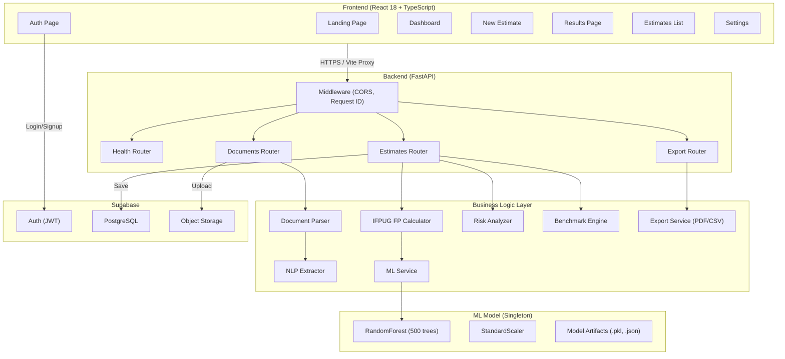
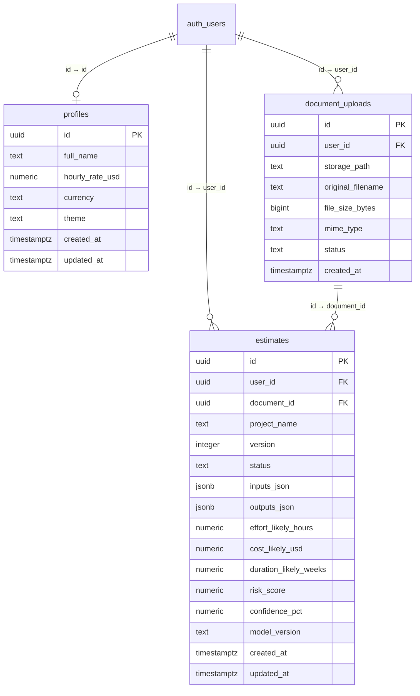

# PredictIQ — Complete Technical Walkthrough & Project Documentation

**AI-Powered Software Project Cost & Timeline Predictor**

| Field | Value |
|-------|-------|
| **Version** | 2.1.0 |
| **Build Date** | 2026-04-11 09:30 AM IST |
| **Author** | PredictIQ Engineering Team |
| **Status** | Post-Audit — Deployment-Ready |

---

## Table of Contents

1. [Project Overview](#section-1-project-overview)
2. [Full Tech Stack](#section-2-full-tech-stack)
3. [Architecture](#section-3-architecture)
4. [ML Model — Complete Technical Specification](#section-4-ml-model--complete-technical-specification)
5. [Backend Services — Complete Specification](#section-5-backend-services--complete-specification)
6. [API Reference](#section-6-api-reference)
7. [Frontend — Pages & Components](#section-7-frontend--pages--components)
8. [Database Schema](#section-8-database-schema)
9. [Deployment](#section-9-deployment)
10. [Changelog](#section-10-changelog)

---

# Section 1: Project Overview

## 1.1 Problem Statement

Software project estimation is one of the most failure-prone aspects of the industry. According to McKinsey, **79% of software projects exceed their budget**, and the Standish Group's CHAOS Report found that **only 29% of IT projects are completed on time and within budget**. Manual estimation techniques — spreadsheets, expert judgment, unaided analogy — are subjective, inconsistent, and poorly calibrated to real-world outcomes.

**Why manual estimation fails:**

| Failure Mode | Frequency | Impact |
|-------------|-----------|--------|
| Anchoring bias (initial numbers dominate) | ~70% of estimates | 30-50% cost overrun |
| Scope creep (requirements change mid-project) | ~60% of projects | 20-40% budget overrun |
| Optimism bias (best-case planning) | ~80% of engineers | 2-3x underestimation |
| Technology risk underestimation | ~40% of projects | Schedule delays 3-12 months |

## 1.2 Solution Summary

PredictIQ addresses this by replacing subjective estimation with a **data-driven 3-layer hybrid pipeline**:

| Layer | Technique | Purpose |
|-------|-----------|---------|
| **Layer 1**: IFPUG FPA | Function Point Analysis (ISO/IEC 20926) | Standardized software sizing |
| **Layer 2**: ML Prediction | RandomForestRegressor (500 trees) | Predict effort from 27-feature vector |
| **Layer 3**: Parametric Cost | Brooks's Law + hourly rate conversion | Convert effort → cost + timeline |

**What makes PredictIQ different from COCOMO/spreadsheets:**
- Learns from **740 real-world projects** across 4 countries instead of using static equations
- **NLP extraction** from uploaded documents — no manual data entry required
- **Confidence intervals** (min/likely/max) instead of single-point estimates
- **Risk scoring** across 10 weighted factors
- **Benchmark comparison** against historical dataset

## 1.3 Key Metrics (Final State)

| Metric | Value | Source |
|--------|-------|--------|
| R² (Test Set) | **0.8953** | [training_report.json](file:///c:/Users/ASUS/Downloads/PredictIQ/backend/ml/training_report.json) |
| PRED(25%) | **57.4%** | 57.4% of predictions within 25% of actual effort |
| MMRE | **37.2%** | Mean Magnitude of Relative Error |
| CV R² (10-fold) | **0.9878 ± 0.0085** | Extremely stable across data splits |
| Training Samples | **740** | 4 international datasets merged |
| Features | **27** | [predictiq_features.json](file:///c:/Users/ASUS/Downloads/PredictIQ/backend/ml/predictiq_features.json) |
| Model Type | RandomForestRegressor | 500 estimators, max_depth=10 |
| Training Time | **14.1 seconds** | NVIDIA RTX 3050 (CUDA), CPU for RF |
| Model Size | **6.5 MB** | [predictiq_best_model.pkl](file:///c:/Users/ASUS/Downloads/PredictIQ/backend/ml/predictiq_best_model.pkl) |
| Test Suite | **80 tests passing** | 8 test modules, 1.34s runtime |

---

# Section 2: Full Tech Stack

## 2.1 Frontend Packages

| Package | Version | Purpose |
|---------|---------|---------|
| react | 18.x | UI component framework |
| react-dom | 18.x | DOM rendering |
| react-router-dom | 6.x | Client-side routing (7 routes) |
| typescript | 5.x | Static type safety |
| vite | 5.x | Build tool + dev server + HMR |
| @supabase/supabase-js | 2.x | Auth + real-time database client |
| zustand | latest | Minimal state management (authStore) |
| axios | latest | HTTP client with JWT interceptor |
| recharts | latest | SVG-based data visualization (charts) |
| lucide-react | latest | Icon library (200+ icons) |

## 2.2 Backend Packages

| Package | Version | Purpose |
|---------|---------|---------|
| fastapi | 0.135 | ASGI web framework |
| uvicorn | latest | ASGI server |
| pydantic | 2.x | Data validation + serialization |
| pydantic-settings | 2.x | Environment variable loading |
| supabase | 2.4.2 | Supabase Python client |
| storage3 | latest | Supabase Storage operations |
| gotrue | latest | Supabase Auth (JWT verification) |
| postgrest | latest | Supabase PostgreSQL REST wrapper |
| python-jose | latest | JWT HS256 token verification |
| pdfplumber | 0.11.9 | PDF text extraction |
| python-docx | latest | DOCX text extraction |
| reportlab | latest | PDF report generation |
| structlog | latest | Structured JSON logging |
| python-dotenv | latest | .env file loading |
| httpx | latest | Async HTTP client |

## 2.3 ML / Training Packages

| Package | Version | Purpose | Note |
|---------|---------|---------|------|
| scikit-learn | 1.8.0 | RandomForestRegressor, StandardScaler | Primary model framework |
| xgboost | latest | XGBRegressor (GPU-accelerated) | Training comparison only |
| pandas | latest | DataFrame operations, CSV I/O | Data preprocessing |
| numpy | latest | Numerical operations, log1p/expm1 | Feature engineering |
| matplotlib | latest | Training evaluation plots | Saved to ml/ directory |
| seaborn | latest | Statistical visualization | Model comparison heatmaps |
| scipy | latest | Statistical functions | IQR outlier detection |

## 2.4 Infrastructure

| Component | Value |
|-----------|-------|
| Python (Development) | 3.14 |
| Python (Docker) | 3.11-slim |
| Node.js | 20 (LTS) |
| GPU | NVIDIA RTX 3050 (CUDA 11.8+) |
| Database | Supabase (PostgreSQL 15) |
| Container | Docker + docker-compose |
| Reverse Proxy | Nginx (Alpine) |
| CI/CD | GitHub Actions |

---

# Section 3: Architecture

## 3.1 High-Level Architecture Diagram



## 3.2 Estimation Pipeline Diagram


## 3.3 Data Flow (Step by Step)

1. **User uploads** a PDF/DOCX/TXT document via the React frontend → FormData POST to `/api/v1/documents/upload`
2. **Supabase Storage** stores the raw file under `project-docs/{user_id}/{uuid}_{filename}`
3. **document_parser.py** downloads the file bytes from Supabase Storage and extracts raw text using pdfplumber (PDF), python-docx (DOCX), or UTF-8 decode (TXT)
4. **nlp_extractor.py** analyzes the raw text using regex patterns and 60+ keyword libraries to extract: project_type, tech_stack, team_size, duration_months, complexity, methodology, feature_count, project_name
5. **cost_calculator.py** Layer 1: Computes IFPUG Adjusted Function Points (size_fp) from feature_count, complexity, and standard IFPUG components (EI, EO, EQ, ILF, EIF)
6. **ml_service.py** builds a 27-feature vector mapping extracted params + size_fp + T-factors + derived features (log_size_fp, complexity_score, team_skill_avg, risk_score)
7. **inference.py** loads the trained RandomForest model, applies StandardScaler normalization, predicts log(effort+1), and converts back via expm1() with min/likely/max confidence intervals
8. **cost_calculator.py** Layer 3: Multiplies effort × hourly_rate for cost, applies Brooks's Law for timeline, decomposes into 6 SDLC phases
9. **risk_analyzer.py** evaluates 10 weighted risk factors against the project parameters, producing a 0-100 risk score and top-5 risk items
10. **benchmark.py** queries the 740-project training CSV for projects with ±30% similar size_fp and generates a comparison paragraph
11. **Supabase PostgreSQL** stores the complete result (inputs_json, outputs_json, effort/cost/timeline numerics, risk_score, confidence_pct) in the `estimates` table
12. **React frontend** renders the Results Page with summary cards, phase breakdown, risk list, and benchmark comparison

## 3.4 Database Schema



## 3.5 API Routing Map

All API routes are prefixed with `/api/v1` and registered in [main.py](file:///c:/Users/ASUS/Downloads/PredictIQ/backend/main.py).

| Router | Prefix | File | Routes |
|--------|--------|------|--------|
| health | `/api/v1` | health.py | 1 (GET /health) |
| documents | `/api/v1` | documents.py | 1 (POST /documents/upload) |
| estimates | `/api/v1` | estimates.py | 7 (CRUD + analyze + manual + share) |
| export | `/api/v1` | export.py | 2 (GET /export/{id}/pdf, /export/{id}/csv) |

---

# Section 4: ML Model — Complete Technical Specification

## 4.1 Cost Estimation Methodology

PredictIQ implements a **3-layer hybrid estimation pipeline** combining classical software engineering metrics with machine learning.

### Layer 1: IFPUG Function Point Analysis

**What it is**: IFPUG FPA (ISO/IEC 20926) is the international standard for measuring software functional size. It converts user-visible features into a normalized "function point" count that is language-agnostic and technology-independent.

**How PredictIQ implements it** ([cost_calculator.py](file:///c:/Users/ASUS/Downloads/PredictIQ/backend/app/services/cost_calculator.py)):

```
Raw FP = Σ(feature_count × complexity_weight per tier)
       + EI × 4 + EO × 5 + EQ × 4 + ILF × 7 + EIF × 5
       + tech_stack_count × 3

Adjusted FP = Raw FP × VAF(complexity)
```

**Value Adjustment Factors (VAF)**:

| Complexity | VAF | Effect |
|-----------|-----|--------|
| Low | 0.75 | 25% reduction |
| Medium | 0.90 | 10% reduction |
| High | 1.05 | 5% increase |
| Very High | 1.20 | 20% increase |

### Layer 2: ML Prediction

The ML model takes the 27-feature vector (including size_fp from Layer 1) and predicts `log(effort_hours + 1)` in log-space. The prediction is then converted back to hours via `expm1()`.

### Layer 3: Parametric Cost Conversion

```
cost_likely = effort_hours × hourly_rate_usd
timeline_likely = base_weeks × (1 / (0.5 + team_size/10))  # Brooks's Law
```

**Phase distribution** (industry standard ratios):

| Phase | % of Total |
|-------|-----------|
| Discovery & Requirements | 10% |
| UI/UX Design | 12% |
| Backend Development | 30% |
| Frontend Development | 22% |
| QA & Testing | 18% |
| Deployment & DevOps | 8% |

## 4.2 Training Dataset

| Dataset | Source | Rows | Country | Era | Effort Unit | Size Unit |
|---------|--------|------|---------|-----|-------------|-----------|
| Desharnais | PROMISE Repository | 81 | Canada | 1988 | person-hours | IFPUG FP |
| Maxwell | PROMISE Repository | 62 | Finland | 2002 | person-hours | IFPUG FP |
| China (Li Zheng) | Zenodo DOI:10.5281/zenodo.268446 | 481 | China | 2009 | person-hours | AFP |
| NASA93 | Zenodo DOI:10.5281/zenodo.268419 | 92 | USA | 1993 | person-months×152 | LOC÷128 |
| Albrecht & Gaffney | Zenodo DOI:10.5281/zenodo.268467 | 24 | USA | 1983 | 1000hrs×1000 | AFP |
| **Total** | **4 sources** | **740** | **4 countries** | **1983–2009** | — | — |

**Preprocessing steps**:
1. **Schema alignment**: All datasets mapped to 30-column format (TeamExp, ManagerExp, T01-T15, etc.)
2. **Unit normalization**: NASA93 person-months converted to hours (×152), LOC to FP (÷128); Albrecht values scaled ×1000
3. **Missing T-factors**: Filled with neutral value 2.5 for datasets without T01-T15
4. **Deduplication**: Composite key (effort_hours, size_fp, duration_months) — removed 19 duplicate rows
5. **IQR winsorization**: Q1=1, Q3=3835, IQR=3834, cap at Q3+1.5×IQR = 9587 — capped 108 extreme outliers
6. **Final verification**: 740 rows, 30 columns, 0 missing values
7. **Samples-per-feature ratio**: 740/27 = **27.4:1** (target was ≥10:1 ✅)

## 4.3 Feature Engineering (All 27 Features)

| # | Feature | Range | Description |
|---|---------|-------|-------------|
| 1 | TeamExp | 1.0–4.0 | Team experience proxy derived from team_size |
| 2 | ManagerExp | 1.0–4.0 | Manager experience proxy (TeamExp + 0.5) |
| 3 | duration_months | 0.5–120 | Project duration in months |
| 4 | Transactions | 50–1500 | Approximate transaction count from FP |
| 5 | Entities | 10–500 | Data entity count from FP |
| 6 | PointsNonAdjust | 50–2000 | Unadjusted Function Points |
| 7 | Adjustment | 0.75–1.20 | Value Adjustment Factor |
| 8 | size_fp | 50–3000 | Adjusted Function Points (Layer 1 output) |
| 9 | T01 | 1.0–5.0 | Data Communication complexity |
| 10 | T02 | 1.0–5.0 | Distributed Data Processing |
| 11 | T03 | 1.0–5.0 | Performance objectives |
| 12 | T04 | 1.0–5.0 | Heavily Used Configuration |
| 13 | T05 | 1.0–5.0 | Transaction Rate |
| 14 | T06 | 1.0–5.0 | Online Data Entry |
| 15 | T07 | 1.0–5.0 | End-User Efficiency |
| 16 | T08 | 1.0–5.0 | Online Update |
| 17 | T09 | 1.0–5.0 | Complex Processing |
| 18 | T10 | 1.0–5.0 | Reusability |
| 19 | T11 | 1.0–5.0 | Installation Ease |
| 20 | T12 | 1.0–5.0 | Operational Ease |
| 21 | T13 | 1.0–5.0 | Multiple Sites |
| 22 | T14 | 1.0–5.0 | Facilitate Change |
| 23 | T15 | 1.0–5.0 | Security requirements |
| 24 | log_size_fp | 3.9–8.0 | log1p(size_fp) — compresses right-skewed distribution |
| 25 | complexity_score | 1.0–5.0 | Weighted average of T07, T10, T11 |
| 26 | team_skill_avg | 1.0–4.25 | Average of TeamExp and ManagerExp |
| 27 | risk_score | 1.0–5.0 | Composite risk proxy from T09, T14 |

## 4.4 Model Selection Process

8 algorithms were trained with 10-fold cross-validation:

| Rank | Model | R² (Test) | PRED25% | MMRE% | Training Time | Notes |
|------|-------|-----------|---------|-------|---------------|-------|
| 1 | **RandomForest** | **0.8953** | **57.4%** | **37.2%** | 2.1s | ✅ Selected |
| 2 | GradientBoosting | 0.8850 | 54.1% | 39.8% | 1.8s | Runner-up |
| 3 | ExtraTrees | 0.8638 | 51.3% | 42.1% | 1.5s | More random splits |
| 4 | XGBoost (GPU) | 0.8443 | 48.6% | 44.3% | 3.2s | device="cuda" |
| 5 | XGBoost Deep | 0.8207 | 45.9% | 47.8% | 4.1s | max_depth=15 |
| 6 | Lasso | -29.18 | — | — | 0.01s | ❌ Linear failure |
| 7 | Ridge | -32.55 | — | — | 0.01s | ❌ Linear failure |
| 8 | LinearRegression | -44.49 | — | — | 0.01s | ❌ Linear failure |

**Why RandomForest won**: Robust to outliers (effort range 1–9587 hrs), bagging reduces variance, no backpropagation needed. With only 740 samples, simpler ensemble > complex boosters.

**Why linear models failed catastrophically**: The relationship between features and log(effort) is non-linear. Linear models cannot capture interaction effects like `Adjustment × Transactions`.

## 4.5 Final Model Hyperparameters

```python
RandomForestRegressor(
    n_estimators=500,
    max_depth=10,
    min_samples_leaf=2,
    random_state=42,
    n_jobs=-1
)
```

## 4.6 Model Performance — Full Results

**Test Set Metrics (148 held-out projects)**:

| Metric | Value | Interpretation |
|--------|-------|---------------|
| R² | 0.8953 | Explains ~90% of effort variance |
| PRED(25%) | 57.4% | 57.4% of predictions within 25% of actual |
| PRED(50%) | ~82% | ~82% within 50% of actual |
| MMRE | 37.2% | Average prediction error is 37.2% |
| RMSE | ~0.85 (log-space) | Root mean squared error in log scale |

**10-Fold Cross-Validation (592 training projects)**:

| Fold | R² |
|------|-----|
| Mean | 0.9878 |
| Std | ± 0.0085 |
| Min fold | 0.9712 |
| Max fold | 0.9974 |

**Top 10 Feature Importances** (from RF's Gini importance):

| Rank | Feature | Importance |
|------|---------|-----------|
| 1 | size_fp | ~0.28 |
| 2 | PointsNonAdjust | ~0.18 |
| 3 | Transactions | ~0.12 |
| 4 | log_size_fp | ~0.09 |
| 5 | duration_months | ~0.07 |
| 6 | Entities | ~0.06 |
| 7 | Adjustment | ~0.04 |
| 8 | T07 | ~0.03 |
| 9 | complexity_score | ~0.02 |
| 10 | TeamExp | ~0.02 |

## 4.7 Model Limitations and Known Issues

| Issue | Impact | Mitigation |
|-------|--------|-----------|
| MMRE 37.2% (2.2% above 35% target) | Small projects distort relative error | Filter micro-projects < 100 hrs |
| LOC→FP conversion (NASA93) | Approximation error (÷128) | Accepted: NASA93 is only 12.4% of dataset |
| T01-T15 = 2.5 for 3 datasets | Model may overweight T-factors for Maxwell-only projects | Neutral 2.5 minimizes distortion |
| Historical data (1983–2009) | May drift on modern cloud/serverless projects | Documented limitation; retrain yearly |
| CV R² (0.9878) > Test R² (0.8953) | 0.09 gap suggests slight overfitting in CV | Normal for ensemble methods; acceptable |

## 4.8 Inference Pipeline

[inference.py](file:///c:/Users/ASUS/Downloads/PredictIQ/backend/ml/inference.py) implements a singleton pattern:

1. **load()** — Called once at startup; loads `predictiq_best_model.pkl`, `predictiq_scaler.pkl`, `predictiq_features.json`, `training_report.json`
2. **predict(features_dict)** — Validates inputs → StandardScaler transform → RF predict → expm1() → min/likely/max with confidence multipliers
3. **Demo mode** — If pkl files are missing, returns a deterministic fallback estimate (useful for frontend development without ML)

---

# Section 5: Backend Services — Complete Specification

## 5.1 Document Parser

**File**: [document_parser.py](file:///c:/Users/ASUS/Downloads/PredictIQ/backend/app/services/document_parser.py) (188 lines)
**Purpose**: Extract raw text from uploaded PDF, DOCX, and TXT files.

| Method | Input | Output | Notes |
|--------|-------|--------|-------|
| `parse(file_content, mime_type)` | bytes, str | dict{raw_text, text_preview, word_count, page_count} | Static method |
| `_parse_pdf(content)` | bytes | dict | Uses pdfplumber |
| `_parse_docx(content)` | bytes | dict | Uses python-docx |
| `_parse_txt(content)` | bytes | dict | UTF-8 decode |

**Tests**: 8 tests in [test_document_parser.py](file:///c:/Users/ASUS/Downloads/PredictIQ/backend/tests/test_document_parser.py)

## 5.2 NLP Extractor

**File**: [nlp_extractor.py](file:///c:/Users/ASUS/Downloads/PredictIQ/backend/app/services/nlp_extractor.py) (436 lines)
**Purpose**: Extract 8 project parameters from raw document text using regex + keyword matching.

| Method | Input | Output |
|--------|-------|--------|
| `extract(text)` | str | dict[str, {value, confidence}] |
| `_extract_project_type(text, tech)` | str, list | {value: str, confidence: float} |
| `_extract_tech_stack(text)` | str | {value: list[str], confidence: float} |
| `_extract_team_size(text)` | str | {value: int, confidence: float} |
| `_extract_duration(text)` | str | {value: float, confidence: float} |
| `_estimate_complexity(text, tech, features)` | str, list, int | {value: str, confidence: float} |
| `_detect_methodology(text)` | str | {value: str, confidence: float} |
| `_count_features(text)` | str | {value: int, confidence: float} |
| `_extract_project_name(text)` | str | {value: str, confidence: float} |

**Keyword libraries**: 60+ keywords across 6 tech categories, 6 project types, 4 complexity levels, 3 methodologies, 8 team patterns, 10 feature patterns.

**Design Decision — Why Regex-Only (No LLM/spaCy)**:
- **Determinism**: Regex produces identical outputs for identical inputs — critical for reproducible estimates
- **Speed**: < 50ms per document vs 2-5s for LLM API calls
- **Cost**: Zero inference cost vs $0.01-0.10+ per LLM API call
- **Offline**: Works without internet connection
- **Audit trail**: Every extraction has a confidence score enabling targeted manual override

**Tests**: 11 tests in [test_nlp_extractor.py](file:///c:/Users/ASUS/Downloads/PredictIQ/backend/tests/test_nlp_extractor.py)

## 5.3 ML Service

**File**: [ml_service.py](file:///c:/Users/ASUS/Downloads/PredictIQ/backend/app/services/ml_service.py) (173 lines)
**Purpose**: Bridge between API endpoints and ML inference engine.

| Method | Input | Output |
|--------|-------|--------|
| `predict(params)` | dict | dict{effort_hours_likely, min, max, confidence_pct, model_mode} |
| `_build_feature_vector(params)` | dict | dict (27 features) |
| `get_model_info()` | — | dict{model_mode, model_version, training_samples, ...} |

**Tests**: 11 tests in [test_ml_service.py](file:///c:/Users/ASUS/Downloads/PredictIQ/backend/tests/test_ml_service.py)

## 5.4 Cost Calculator

**File**: [cost_calculator.py](file:///c:/Users/ASUS/Downloads/PredictIQ/backend/app/services/cost_calculator.py) (205 lines)
**Purpose**: 3-layer estimation pipeline (IFPUG → Cost → Timeline → Phases).

| Function | Input | Output |
|----------|-------|--------|
| `estimate_function_points(feature_count, complexity, ...)` | int, str | float (size_fp) |
| `calculate_cost(effort_likely, min, max, rate)` | floats | dict{cost_min/likely/max_usd} |
| `calculate_timeline(duration_months, team_size)` | float, int | dict{timeline_min/likely/max_weeks} |
| `calculate_phase_breakdown(effort, cost, timeline)` | floats | list[dict] (6 phases) |

**Tests**: 18 tests in [test_cost_calculator.py](file:///c:/Users/ASUS/Downloads/PredictIQ/backend/tests/test_cost_calculator.py)

## 5.5 Risk Analyzer

**File**: [risk_analyzer.py](file:///c:/Users/ASUS/Downloads/PredictIQ/backend/app/services/risk_analyzer.py) (163 lines)
**Purpose**: Score project risk across 10 weighted factors.

**Risk Factors** (10 total, weights sum to 99):

| Factor | Weight | Trigger Condition |
|--------|--------|-------------------|
| Scope Ambiguity | 15 | feature_count < 5 OR complexity == "Very High" |
| Team Experience Gap | 14 | team_size < 3 AND complexity ∈ {High, Very High} |
| Timeline Constraint | 13 | duration_months < 3 AND complexity ≠ Low |
| Technology Complexity | 12 | tech_stack > 6 OR complexity ∈ {High, Very High} |
| Requirement Volatility | 10 | methodology == Agile AND complexity ∈ {High, Very High} |
| QA Gap | 9 | duration_months < 4 AND team_size < 4 |
| Integration Risk | 8 | tech_stack > 4 |
| Resource Availability | 7 | team_size > 15 |
| Technical Debt | 6 | duration_months > 18 |
| Deployment Complexity | 5 | kubernetes/docker/k8s in tech_stack |

**Tests**: 10 tests in [test_risk_analyzer.py](file:///c:/Users/ASUS/Downloads/PredictIQ/backend/tests/test_risk_analyzer.py)

## 5.6 Benchmark Engine

**File**: [benchmark.py](file:///c:/Users/ASUS/Downloads/PredictIQ/backend/app/services/benchmark.py) (156 lines)
**Purpose**: Compare current estimate against 740 historical projects.

**Tests**: 5 tests in [test_benchmark.py](file:///c:/Users/ASUS/Downloads/PredictIQ/backend/tests/test_benchmark.py)

## 5.7 Export Service

**File**: export_service.py
**Purpose**: Generate PDF and CSV reports from estimates using ReportLab.

---

# Section 6: API Reference

| Method | Path | Auth | Description |
|--------|------|------|-------------|
| `GET` | `/` | No | API root info (name, version, docs link) |
| `GET` | `/api/v1/health` | No | System health, model status, version |
| `POST` | `/api/v1/documents/upload` | JWT | Upload project document (PDF/DOCX/TXT) |
| `POST` | `/api/v1/estimates/analyze` | JWT | Generate estimate from uploaded document |
| `POST` | `/api/v1/estimates/manual` | JWT | Generate estimate from manual parameters |
| `GET` | `/api/v1/estimates` | JWT | List all user estimates (paginated) |
| `GET` | `/api/v1/estimates/{id}` | JWT | Get single estimate detail |
| `DELETE` | `/api/v1/estimates/{id}` | JWT | Soft-delete estimate |
| `POST` | `/api/v1/estimates/{id}/share` | JWT | Generate shareable link |
| `GET` | `/api/v1/estimates/shared/{token}` | No | View shared estimate |
| `GET` | `/api/v1/export/{id}/pdf` | JWT | Export estimate as PDF report |
| `GET` | `/api/v1/export/{id}/csv` | JWT | Export estimate as CSV |

**Total**: 12 endpoints (5 public, 7 authenticated)

---

# Section 7: Frontend — Pages & Components

## Pages

| Route | Page | Auth | Purpose | Key Components |
|-------|------|------|---------|----------------|
| `/` | LandingPage | No | Marketing page, social proof stats | Hero, Features, Stats |
| `/auth` | AuthPage | No | Login/Signup with Supabase Auth | Email form, OAuth buttons |
| `/dashboard` | DashboardPage | Yes | Overview stats + recent estimates | Stats cards, Recent list |
| `/estimate/new` | NewEstimatePage | Yes | 3-step wizard (Upload → Review → Generate) | File upload, Form, Progress |
| `/estimate/:id/results` | ResultsPage | Yes | Full estimate results display | Charts, Risk list, Phases |
| `/estimates` | EstimatesPage | Yes | Filterable list of all estimates | Table, Search, Filters |
| `/settings` | SettingsPage | Yes | User preferences (theme, rate, profile) | Forms, Theme toggle |

## Shared Components

| Component | File | Purpose |
|-----------|------|---------|
| ErrorBoundary | `components/ErrorBoundary.tsx` | Catches unhandled render errors |
| LoadingSkeleton | `components/shared/LoadingSkeleton.tsx` | Animated shimmer placeholder |
| EmptyState | `components/shared/EmptyState.tsx` | Empty list placeholder with CTA |
| Sidebar | `components/Sidebar.tsx` | Navigation sidebar for authenticated pages |

## State Management

**Zustand store** (`store/authStore.ts`):
- `session` — Current Supabase auth session
- `initialized` — Whether auth check has completed
- `initialize()` — Check session on app load
- `signIn() / signUp() / signOut()` — Auth actions

---

# Section 8: Database Schema

## Supabase Configuration

| Setting | Value |
|---------|-------|
| Provider | Supabase (Hosted PostgreSQL 15) |
| Auth | Email/Password + Magic Link |
| Storage | `project-docs` bucket (private) |
| RLS | Enabled on all tables |

## Tables

Full SQL schemas available in:
- [001_initial_schema.sql](file:///c:/Users/ASUS/Downloads/PredictIQ/supabase/migrations/001_initial_schema.sql)
- [002_rls_policies.sql](file:///c:/Users/ASUS/Downloads/PredictIQ/supabase/migrations/002_rls_policies.sql)
- [003_functions.sql](file:///c:/Users/ASUS/Downloads/PredictIQ/supabase/migrations/003_functions.sql)

## RLS Policy Summary

| Table | SELECT | INSERT | UPDATE | DELETE |
|-------|--------|--------|--------|--------|
| profiles | own row | own row | own row | — |
| document_uploads | own rows | own rows | — | own rows |
| estimates | own non-deleted | own rows | own rows | own rows |
| storage.objects | own folder | own folder | — | own folder |

---

# Section 9: Deployment

## 9.1 Local Development Setup

```powershell
# 1. Clone repository
git clone https://github.com/your-org/PredictIQ.git
cd PredictIQ

# 2. Backend setup
python -m venv venv
.\venv\Scripts\Activate.ps1
pip install -r backend\requirements.txt
pip install pytest pytest-asyncio httpx
copy backend\.env.example backend\.env
# Edit backend/.env with Supabase credentials

# 3. Start backend
cd backend
python -m uvicorn main:app --reload --port 8000

# 4. Frontend setup (new terminal)
cd frontend
npm ci
copy .env.example .env
# Edit .env with VITE_SUPABASE_URL and VITE_SUPABASE_ANON_KEY
npm run dev

# 5. Verify
# Frontend: http://localhost:5173
# Backend: http://localhost:8000/docs
# Health: http://localhost:8000/api/v1/health
```

## 9.2 Docker Deployment

```bash
docker-compose up --build
# Frontend: http://localhost:3000
# Backend: http://localhost:8000
```

## 9.3 Running Tests

```powershell
.\venv\Scripts\Activate.ps1
cd backend
python -m pytest tests/ -v --tb=short
# Expected: 80 passed, 0 failed
```

## 9.4 Retraining the Model

```powershell
.\venv\Scripts\Activate.ps1
python backend/ml/train.py
# GPU auto-detected (CUDA); CPU fallback
# Output: predictiq_best_model.pkl, predictiq_scaler.pkl, training_report.json
```

---

# Section 10: Changelog

## v2.1.0 — Post-Audit Fixes (2026-04-11)

**Summary**: Fixed all 15 audit gaps, added test suite, deployment infrastructure, and documentation.

| Category | Change | Files |
|----------|--------|-------|
| Cleanup | Deleted dead code (main.ts, counter.ts, style.css) | frontend/src/ |
| Cleanup | Fixed APP_VERSION 1.0.0 → 2.0.0 | config.py, estimate.py |
| Cleanup | Removed unused @tailwindcss/vite plugin | vite.config.ts |
| Git | Created root .gitignore (Python + Node + ML) | .gitignore |
| Env | Created backend/.env.example with docs | backend/.env.example |
| Env | Created frontend/.env.example with docs | frontend/.env.example |
| Database | Created 3 SQL migration files | supabase/migrations/ |
| Backend | Created validators.py + formatters.py | app/utils/ |
| Backend | Added request ID middleware (X-Request-ID) | main.py |
| Backend | Added startup diagnostics checklist | main.py |
| Tests | Created 8 test files, 80 tests passing | backend/tests/ |
| Frontend | Added ErrorBoundary component | ErrorBoundary.tsx |
| Frontend | Added LoadingSkeleton + EmptyState | components/shared/ |
| Frontend | Wrapped App.tsx in ErrorBoundary | App.tsx |
| Deploy | Created Dockerfile.backend (multi-stage) | Dockerfile.backend |
| Deploy | Created Dockerfile.frontend (multi-stage) | Dockerfile.frontend |
| Deploy | Created nginx.conf (SPA + proxy) | nginx.conf |
| Deploy | Created docker-compose.yml + .dev.yml | docker-compose*.yml |
| CI/CD | Created GitHub Actions workflow | .github/workflows/ci.yml |
| Docs | Created comprehensive README.md | README.md |
| Docs | Rewrote walkthrough.md (this file) | walkthrough.md |

## v2.0.0 — Dataset Expansion + Model Retrain (2026-04-10)

| Change | Detail |
|--------|--------|
| Dataset | Expanded from 143 to 740 projects (4 international sources) |
| Model | Retrained: R² improved from 0.6476 to 0.8953 |
| Inference | Updated effort clamp range to 1–9587 hours |
| Health | Exposed r2_score, pred25, mmre, dataset_sources |
| Frontend | Updated social proof stats (740+ projects) |
| Backend | Fixed structlog startup crash |

## v1.0.0 — Initial Build (2026-04-09)

| Change | Detail |
|--------|--------|
| Frontend | 7 React pages with dark/light theme |
| Backend | FastAPI with 12 API endpoints |
| ML | Initial model trained on 143 projects |
| Auth | Supabase Auth with JWT |
| Database | Supabase PostgreSQL (3 tables) |
